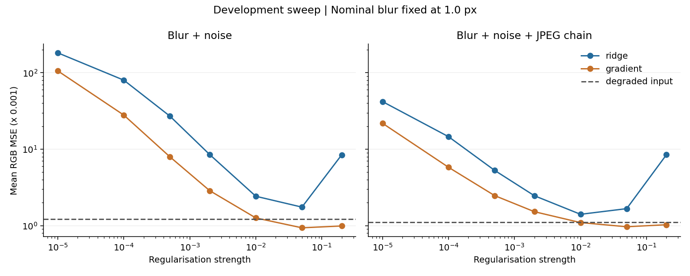
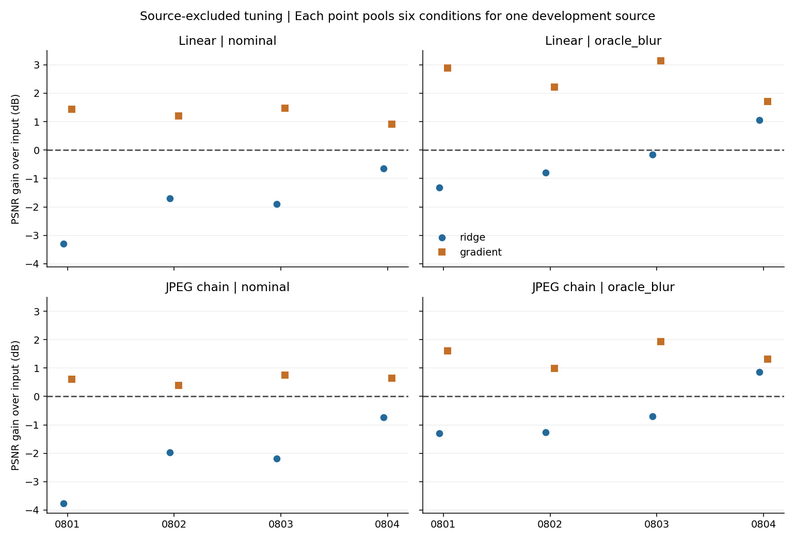
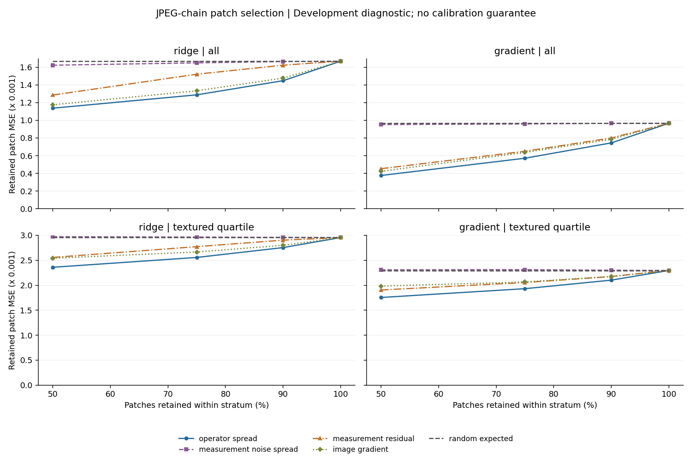

# Baseline 01: regularisation and patch-selection development

17 September 2026. **Development evidence from four sources; novelty is unestablished.**

**Colab status update:** the [user's saved Colab execution has now been reviewed](colab_execution_review_2026-09-17.md): eleven consecutively numbered code cells, no saved error outputs, three reconciled tables and four inspected embedded figures. One non-fatal pandas warning and inherited local-run metadata are documented. This closes the earlier notebook-inspection gap for that run; the original local-execution record below is retained.

The weak Pilot 00 baseline warranted a regularisation diagnostic before further development of the proposed reliability score. The new gradient-regularised inverse improves over the degraded input in all 48 simulated source/condition combinations. The ridge inverse still underperforms on average. This is sufficient to retain a stronger classical comparator for the next experiment; it does not validate a new research contribution.

## Executed experiment

- [Self-contained notebook](../../notebooks/01_DIV2K_Baseline_Development.ipynb), [computational source](baseline.py), and [saved outputs](outputs/run_20260917/).
- DIV2K 0801–0804: the same four previously exposed development sources, 512 × 512 native centre evaluation regions with 32-pixel context margins. Decoded RGB hashes match the repository's official-archive manifest.
- True Gaussian blur widths 1.2, 1.6 and 2.0 pixels; noise standard deviations 2/255 and 5/255; linear and clipping/quantisation/JPEG-chain conditions. The nominal inverse always assumes blur width 1.0. An oracle diagnostic receives the true blur width but does not undo the JPEG chain.
- Ridge and periodic gradient regularisation, seven strengths each. One strength per family/information mode is selected using the other three development sources, equally pooling their conditions. No evaluated source enters its own strength-selection fold. All four sources have already influenced development, so this is not independent testing.
- 48 observations, 1,344 inverse grid rows, 192 selected-inverse rows, 96 control rows, and 4,608 patch-risk rows. These counts do not represent independent images or noise repetitions.

## Quality results

Pooled PSNR is computed from mean RGB MSE over the 24 source/condition combinations in each row. It is distinct from the mean image PSNR, also saved in `summary.csv`. Higher PSNR is better.

| Condition | Input | Fixed 0.5 px smoothing | Nominal ridge | Nominal gradient | Oracle-blur gradient |
|---|---:|---:|---:|---:|---:|
| Blur + noise | 29.147 dB | 29.458 dB | 27.581 dB | 30.288 dB | 31.357 dB |
| Blur + noise + JPEG chain | 29.533 dB | 29.414 dB | 27.779 dB | 30.148 dB | 30.944 dB |

The nominal gradient inverse gains **1.141 dB** and **0.615 dB** over the respective inputs. It improves each of the 24 individual combinations in each condition. All 16 source/family/information selections lie inside the tested grid: gradient selects 0.05 in both information modes, nominal ridge 0.05, and oracle-blur ridge 0.01. These choices are development findings, not general-purpose recommended hyperparameters.

The gradient penalty preserves a constant image's DC component, whereas ridge shrinks it. The numerical check verifies this mathematical distinction; it does not establish that DC behaviour alone explains the observed quality difference.





## Patch selection

Scores rank 16 × 16 patches within each image. Comparators are measurement residual, reconstructed-image gradient and fixed-operator measurement-noise spread. The noise probe amplitude is fixed at 2/255 and does not receive the true acquisition noise. The clean-reference gradient defines the top-texture quartile only for evaluation; it is never supplied to an operational score.

For the gradient inverse, the following are pooled MSE reductions from operator spread relative to the best of those three comparators **at the same 50% retained coverage**, selected separately for each row. Positive is better.

| Condition | All patches | Within the reference-defined textured quartile |
|---|---:|---:|
| Blur + noise | 9.94% | 11.32% |
| Blur + noise + JPEG chain | 11.18% | 7.88% |

The pooled reductions remain positive at the prespecified 75% and 90% coverage values; all methods reconcile at 100%. Complete tables preserve the ridge results, both processing conditions, every source and every coverage. At 50%, the gradient inverse's source-specific comparisons, averaged across six severities, are also positive, but their magnitude varies substantially. No statistical significance or unseen-source robustness is inferred.



These findings differ from Pilot 00's negative pixel-selection comparison. **The reconstruction, tuning, condition grid and selection unit have all changed.** This is not an isolated ablation showing that baseline improvement alone caused the change. The four-source ridge anchor at the original settings reproduces all four previously reported pooled inverse PSNR values.

## Verification and runtime boundary

The original local validation executed all nine code cells in order in a fresh, in-process IPython session; its notebook contains text/table outputs and four figures, with no error outputs. The original cell code was executed without replacement. A standard Jupyter kernel could not start because the environment denied its socket operations. Colab execution and Drive mounting were unverified at that initial checkpoint; the subsequent saved Colab review linked above supersedes that pending status. The local fallback and its scope remain recorded in the original notebook metadata.

Independent tiny dense solves agree with the FFT inverses to below 4 × 10⁻¹⁵ maximum absolute error. Constant-image, PSNR, risk-order and endpoint checks pass. Saved output hashes, tuning exclusions, selected rows and summary arithmetic are checked by readback; [validation.json](validation.json) records the final artifact audit. All four figures were inspected. The sweep's logarithmic vertical axis makes the small errors near the optimum visible without dropping the poor settings.

There are fourteen result files plus their export manifest. Original full-resolution source images are not committed; the reconstruction montage contains attributed DIV2K crop examples for this research diagnostic. Numerical results use stored gamma-encoded RGB and periodic Fourier blur, not calibrated camera physics.

## Reproduction

In Colab, open the notebook and run all cells. It uses the same Drive `reliable-reconstruction-under-mismatch/samples` folder as Pilot 00 and writes directly to a new dated `results/pilot_01_...` folder, including hashes. No GPU is needed. The original notebook is preserved.

For the documented local fallback, install `numpy pandas matplotlib Pillow nbformat IPython matplotlib-inline`, then run from the repository root:

```bash
IMAGING01_DATA_DIR=/path/to/samples python scripts/execute_notebook_inprocess.py notebooks/01_DIV2K_Baseline_Development.ipynb
```

The runner updates the notebook with captured outputs. An optional `IMAGING01_OUTPUT_DIR` must name a new destination. To regenerate the notebook code after changing the source, run `python scripts/build_baseline_01_notebook.py`; regeneration clears saved outputs until execution.

## Decision and remaining work

Retain the umbrella topic and the gradient-regularised development baseline. Before expanding the mechanism, audit and run a verified learned reconstruction baseline and an appropriate image-only uncertainty comparator with stated information, compute and training-data overlap. Use genuinely separate sources for calibration and final evaluation. Two classical regularisers do not substitute for multiple learned reconstruction families.

Operator spread here covers only 0.8/1.0/1.2-pixel nominal blur. Most true blurs lie outside that range. It is neither a calibrated posterior nor a guarantee of measurement-supported detail. MSE improvement is not a hallucination-detection result. Read the unresolved direct competitor and establish a precise distinction from existing methods before any novelty claim.

The scoping-review route has its own evidence-mapping contribution and remains conditional on prior-review overlap and rigorous methods. Its protocol and screening status are preserved. See the [two-track decision note](../../docs/research_routes_decision_2026-09-17.md) and [provisional literature synthesis](../../literature/synthesis/provisional_gap_synthesis_01.md).
