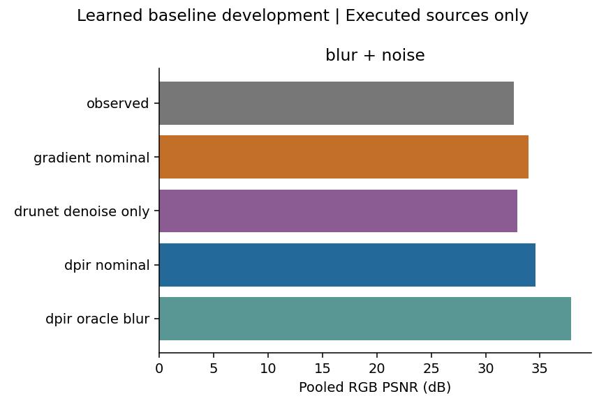
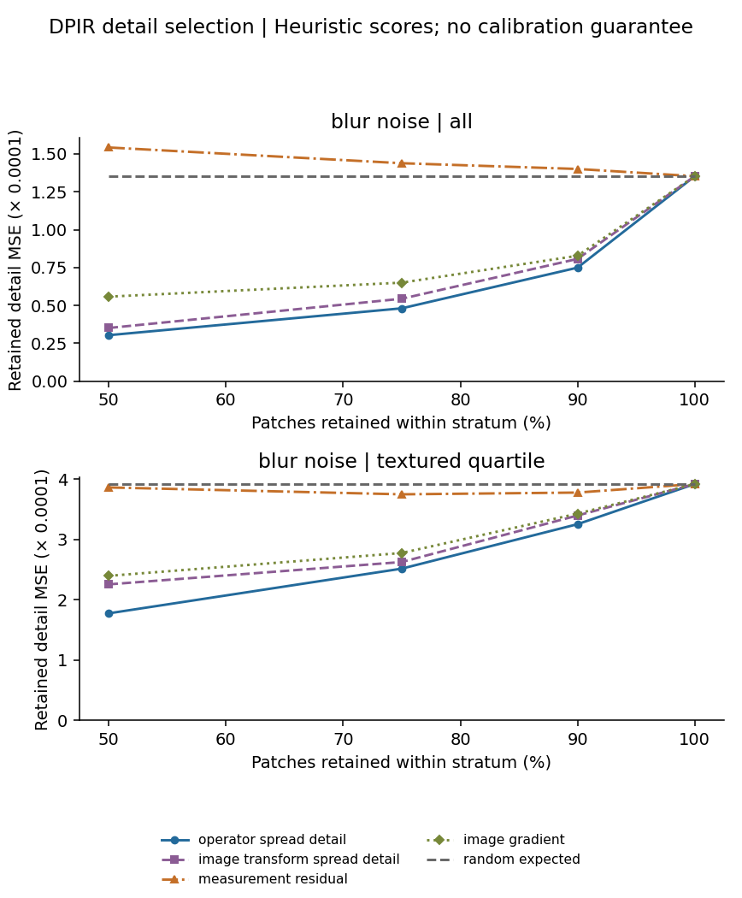

# Learned baseline 02: verified DRUNet development

17 September 2026. **The user's eight-observation Colab run is now reviewed.**

**Latest checkpoint:** [read the completed Colab review](colab_execution_review_2026-09-17.md). Nine unchanged code cells report completion of all eight observations on CUDA; six retrieved CSVs reproduce the displayed tables. Nominal DPIR improves over the classical baseline by 0.494 dB for linear blur/noise but loses by 0.412 dB with the JPEG chain, where its detail MSE is 35.237% higher. Positive mean-error selection comparisons coexist with bad-detail-rate and source-specific exceptions. All four embedded figures were inspected; complete raw-export hash verification remains pending after a raw-transfer access error.

The sections below preserve the original one-case local validation and its execution limits. Their statements that the full Colab experiment was pending are historical; the linked review supersedes that status. The initial canary and its validated export hashes are unchanged.

This checkpoint adds a pretrained reconstruction comparator after Baseline 01 repaired the weak classical baseline. It keeps the research topic and tests the proposed sensitivity mechanism under a learned prior. It does not establish novelty, calibrated uncertainty or independent-test performance.

## What is ready

- [Self-contained Colab notebook](../../notebooks/02_DIV2K_Learned_Baseline.ipynb), [adapter source](learned.py), [frozen design](design_freeze.md) and [upstream provenance](provenance.json).
- Official colour DRUNet checkpoint, loaded strictly into its published architecture: 32,640,960 parameters. All state-dictionary keys match. The official downloader identifies the KAIR release URL; the observed checkpoint size and SHA-256 are recorded. The digest is locally observed, not publisher-signed.
- Four upstream files are preserved byte-for-byte at commit `15bca3fcc1f3cc51a1f99ccf027691e278c19354`, including the MIT licence. The network's import namespace is adapted only at load time; model layers and weights are unchanged.
- Default configuration: four previously exposed DIV2K sources, 0801–0804, each with linear blur/noise and the JPEG chain. True blur is 1.6 px and noise is 2/255. All operational methods receive fixed nominal blur 1.0 px and noise 2/255; only the labelled oracle diagnostic receives true blur.
- Local validation is restricted explicitly to **0801, linear blur/noise**, at the same 576 × 576 native centre crop and 512 × 512 evaluation region. The complete comparison variants and eight iterations are retained. This is one of the planned eight observations, not a shortened full experiment.

## Methods

The adapter uses a periodic FFT half-quadratic-splitting data update and official DRUNet denoising with the published logarithmic 49-to-2 schedule, trade-off 0.23 and periodical geometric transforms. It runs the denoiser on the full tensor instead of the upstream demo's recursive quadrant tiling. The simulator uses an analytic Gaussian transfer in stored gamma-encoded RGB, and the output is clipped floating RGB instead of a rounded uint8 benchmark export. These are declared **DPIR-style adaptations**, not a reproduction of the paper's benchmark scores.

Comparators are the input, the gradient inverse with lambda 0.05 inherited from Baseline 01, one-call denoising-only DRUNet, nominal DPIR and true-blur DPIR. Denoising-only DRUNet is an operator-oblivious control, not a strong trained deblurring comparator. In the JPEG condition the oracle blur still omits the codec chain.

Operator detail spread uses assumed blur widths 0.8/1.0/1.2. The fixed-operator image-transformation score uses original, 90° and 180° inputs and reverses the rotations after reconstruction. Both scores use three complete eight-iteration reconstructions and share the nominal output: each adds sixteen denoiser calls. Recorded wall times may differ. Residual and image-gradient scores are inexpensive additional controls; RGB operator spread is secondary. Neither ensemble provides posterior samples or calibrated uncertainty.

The detail transform is `D(x) = x − G₁*x`, applied before removing the 32 px context margin. Risk is evaluated on 16 × 16 patches at 50%, 75%, 90% and 100% coverage, over all patches and within the clean-reference top texture quartile. Reference-derived strata and the oracle-error ranking are evaluation-only. Bad-detail rates use prespecified patch detail-RMSE tolerances 0.025, 0.05 and 0.10. They are not calibration guarantees or direct measurements of hallucination.

The default eight observations require 392 experiment denoiser calls; the one-observation validation uses 49, plus two small validation calls. Costs exclude final score calculation, plotting and file export. CPU memory is process-lifetime peak RSS, not isolated per-inference memory. CUDA peak allocated memory is recorded when available.

## Executed local result: 0801, linear anchor only

The complete one-case comparison finished in 324.31 seconds for the main notebook cell. Logged reconstruction calls total 320.17 seconds; nominal DPIR alone took 56.04 seconds on this CPU. This is timing for one run, not a hardware benchmark.

| Reconstruction | RGB PSNR | Gain over input |
|---|---:|---:|
| Degraded input | 32.583 dB | — |
| Gradient inverse, nominal blur | 33.954 dB | +1.371 dB |
| DRUNet denoising only | 32.940 dB | +0.357 dB |
| DPIR-style, nominal blur | 34.581 dB | +1.998 dB |
| DPIR-style, true-blur diagnostic | 37.837 dB | +5.254 dB |

Nominal learned reconstruction gains **0.627 dB** over the inherited classical comparator on this single case. True blur supplies additional information, so the oracle result is a diagnostic, not a fair operational competitor.

At 50% patch retention, operator detail spread reduces detail MSE by **13.58%** over the lowest-error included operational comparator across all patches, and **21.29%** within the reference-defined texture quartile. In both comparisons the lowest-error comparator is image-transformation detail spread. The reductions remain positive at the prespecified 75% and 90% coverages; all scores meet at 100%. These are within-image descriptive comparisons, not independent replication or statistical significance.

The 0.05 and 0.10 detail-RMSE tolerances produce **zero bad-detail rates throughout this case**, including at full coverage. They provide no discrimination here and do not demonstrate calibrated safety. The 0.025 tolerance is nonzero in some selections. All three prespecified tolerances are retained; they were not adjusted after inspecting the results.

The residual score is poor here: at 50% coverage over all patches, its retained detail MSE exceeds the expected random-selection error. No causal explanation is established by this single case. The denoising-only control also remains below the classical inverse. Full tables retain those comparisons.

[Saved output directory](outputs/canary_20260917/) contains five quality rows, 56 risk rows, 48 iteration records and eight cost rows. All 16 exported files match the manifest. The nominal prediction and saved patch arrays reproduce the reported errors and score selections on readback. Input and classical-gradient errors reproduce the exact Baseline 01 anchor. [Artifact validation](validation.json) records these checks.

All four figures were inspected. The montage shows the DIV2K 0801 centre crop (a penguin); source-image copyright and DIV2K research terms apply. Full nominal predictions are saved for audit, but source images and pretrained weights are not committed.





## Verification and execution boundary

A measured full-size denoiser pass took 8.47 seconds on the preparation CPU. This motivated the predeclared one-case local validation rather than silently changing resolution or iteration count. CPU execution uses four Torch threads and deterministic algorithms. GPU performance and Colab execution of Notebook 02 have not been verified here.

The notebook is executed in order in a fresh in-process IPython session, because native Jupyter kernel sockets are unavailable in this environment. This captures outputs but does not validate Colab's kernel lifecycle or Drive mounting. It is distinct from the user's already-reviewed Baseline 01 Colab run. The sequential runner reported all nine cells completed, but file readback initially retained only the first seven. The unchanged final two presentation cells were separately replayed from the persisted CSVs and PNGs using `scripts/restore_learned_02_displays.py`. The notebook records that replay explicitly; numerical inference was not repeated or replaced. The final file contains all nine cell outputs and four figures, and passes schema/readback validation.

Checks cover strict checkpoint loading, official file hashes, the upstream schedule, transform inverses, isotropic forward-operator rotation consistency, a tiny independent dense HQS solve, finite learned output and a repeated learned smoke case. Source identities, unchanged input bytes, output row counts, risk endpoints and export hashes are checked. A separate readback audit reconciles saved predictions/patch errors and the unchanged classical anchor with Baseline 01.

## Interpretation and next step

The DPIR paper reports training on 900 DIV2K images. The exact image manifest used to train the released checkpoint is unavailable. These four development images cannot establish unseen-image performance for these weights. All crops and degraded versions inherit that restriction.

Run the complete eight-observation notebook before drawing a four-source development conclusion. Retain negative or conflicting comparisons. A promising score still needs stronger learned image-only uncertainty, independent reconstruction families, compute comparisons and source-disjoint calibration/testing. The operator range 0.8–1.2 does not include the true width 1.6 and is not a calibrated plausible-operator distribution. Closest-method novelty checks and the separate scoping-review requirements remain outstanding.

## Reproduction

Open the notebook in Colab, select a GPU runtime if available, and run all cells. Images are read from `MyDrive/reliable-reconstruction-under-mismatch/samples`. The official weights (~131 MB) are cached in `model_cache`. Each run writes directly to a new dated `results/learned_02_...` folder containing six CSVs, five JSONs, four figures, one prediction/patch archive per observation and an export manifest. Prior outputs are not overwritten. Default full-run totals are 23 exported files plus the manifest; the one-observation validation has 16 plus the manifest.

For local validation, dependencies are `torch numpy pandas matplotlib Pillow nbformat IPython matplotlib-inline`. On a Linux CPU environment, from the repository root:

```bash
IMAGING02_DATA_DIR=/path/to/samples \
IMAGING02_SOURCE_IDS=0801 \
IMAGING02_SCENARIOS=blur_noise \
python scripts/execute_notebook_inprocess.py \
  notebooks/02_DIV2K_Learned_Baseline.ipynb \
  --scope 'One source (0801), linear anchor only; full eight-observation run pending.'
```

Optional `IMAGING02_OUTPUT_DIR` must name a new folder. `IMAGING02_WEIGHTS` can point to an existing checkpoint with the recorded digest. Omit source/condition overrides for all eight observations. Run `python scripts/build_learned_02_notebook.py` to regenerate the code; this clears saved notebook outputs. The notebook embeds the upstream licence, source and all computational helpers, but not the raw DIV2K images or pretrained checkpoint.

Sources: [official DPIR code](https://github.com/cszn/DPIR/tree/15bca3fcc1f3cc51a1f99ccf027691e278c19354), [paper, inspected v2](https://arxiv.org/html/2008.13751v2), [official checkpoint downloader](https://github.com/cszn/DPIR/blob/15bca3fcc1f3cc51a1f99ccf027691e278c19354/main_download_pretrained_models.py), [Baseline 01](../baseline_01/README.md).
