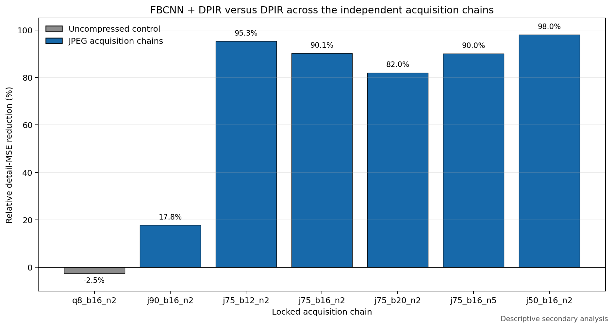

# Acquisition-Chain-Aware Reconstruction Under Forward-Model Mismatch: A Locked Independent Evaluation of JPEG Deblocking, Selective Risk, and Reliability

**Working manuscript draft — 25 September 2026**

Author order, affiliations, target venue, and citation style remain to be
finalised. Numerical statements in this draft are locked to the Stage 05E/05F
evidence package.

## Abstract

Image reconstruction systems can fail when the deployed acquisition chain
differs from the forward model assumed during inversion. This study evaluates
whether JPEG-aware preprocessing and operator-sensitive uncertainty improve
reconstruction fidelity and selective release under such mismatch. We froze an
independent protocol before inspecting test performance, sealed 40 natural-image
sources across seven acquisition chains, fitted reliability components using
development data only, and evaluated two confirmatory hypotheses using paired
source-level inference. On the primary JPEG chain, FBCNN preprocessing followed
by nominal DPIR reduced source-level detail mean-squared error by 90.13% relative
to nominal DPIR alone (paired 95% bootstrap interval for the absolute difference
-1.67013e-04 to -7.43841e-05; Holm-adjusted one-sided p = 1.99998e-05), passing
the predeclared reconstruction gate. Improvements occurred on all six JPEG
chains, whereas the uncompressed control changed by -2.53%, indicating an
acquisition-chain-specific effect. At 50% coverage, operator-spread selection
reduced retained-patch detail risk by 4.46% relative to image-transform spread
(paired 95% bootstrap interval -5.13609e-07 to -8.98451e-08;
Holm-adjusted one-sided p = 1.99998e-05). This effect was statistically
detectable but did not reach the predeclared 5% practical threshold. Across
286,720 calibration patch rows, the locked bad-detail event had zero observed
positives, preventing validation of positive-event calibration. The results
support a bounded acquisition-chain and reliability-assessment contribution,
not the original unified novelty claim. They show the value of preserving
negative gates and calibration failures when assessing reconstruction systems
under deployment mismatch.

**Keywords:** inverse problems; forward-model mismatch; image reconstruction;
JPEG artifacts; uncertainty quantification; selective prediction; reliability;
reproducibility

## 1. Introduction

Modern image reconstruction methods often combine an explicit data-consistency
model with learned priors. Their performance can degrade when the true capture
pipeline includes unmodelled operations such as compression, resampling,
quantisation, noise, or parameter drift. In these settings, visually plausible
output is not sufficient evidence that observation-supported detail has been
recovered. A deployment-oriented evaluation must therefore ask both how much
fidelity is recovered and whether a reliability mechanism correctly identifies
where error remains.

The broad problem is well established. The evidence map locked for this study
contains work on physics-informed mismatch handling, blind or joint
image/operator inference, all-in-one restoration, diffusion priors, uncertainty
estimation, selective prediction, and calibration. The unresolved question is
narrower: under a fixed compound acquisition protocol, does explicit treatment
of a missing compression stage materially improve reconstruction, and does an
operator-sensitive score improve selective retention beyond an image-transform
score?

We answer this using a deliberately staged design. Development data were used
to choose one setting per method family and fit reliability components. Five
test shards remained sealed through inference. The analysis code, endpoints,
practical thresholds, resampling procedures, and multiplicity correction were
locked before test performance was inspected. This design separates model
development from evidence generation and makes failed gates part of the primary
record.

The study makes three bounded contributions:

1. a locked independent test of JPEG-aware deblocking before mismatch-aware
   DPIR across compressed and uncompressed acquisition chains;
2. a confirmatory comparison of operator-spread and image-transform-spread
   selective-risk scores under a predeclared practical threshold; and
3. an auditable demonstration that a reliability target can be too rare in the
   independent sample to support positive-event calibration claims.

## 2. Literature and novelty boundary

The literature boundary was frozen to 15 September 2026. It contains 90 studies,
including 81 peer-reviewed works and 62 coded closest competitors. It is a
locked rapid evidence map used to constrain claims; it is not presented as a
completed registered systematic review.

The evidence establishes that none of the following is individually novel:
physics-informed reconstruction under operator error, blind degradation
estimation, joint image/operator recovery, all-in-one restoration, learned
diffusion priors, uncertainty scoring, or calibration. Accordingly, this study
does not claim the first method in any of those categories. Its contribution is
the independently locked acquisition-chain comparison and the transparent
joint interpretation of a strong reconstruction effect, a subthreshold
selective-risk effect, and a non-estimable positive-event calibration target.

**Citation-completion note:** replace this paragraph with grouped, verified
citations from `literature_snapshot.csv` and `nearest_competitors.csv`. Retain
the boundary above when the prose is expanded.

## 3. Methods

### 3.1 Design and separation of roles

The experiment used development-only selection followed by one-time locked
independent evaluation. Development reconstruction shards supported method and
hyperparameter selection. Development reliability data supported fitting the
PatchErrorNet ensemble and calibration mappings. Independent sources were not
used for those choices. Test inference was completed while performance remained
uninspected, after which Stage 05E performed the single locked analysis and
Stage 05F combined the result with the frozen literature boundary.

### 3.2 Independent sample and acquisition chains

The independent sample contained 40 sealed natural-image sources evaluated over
seven chains: one uncompressed control (`q8_b16_n2`) and six JPEG chains
(`j90_b16_n2`, `j75_b12_n2`, `j75_b16_n2`, `j75_b20_n2`, `j75_b16_n5`, and
`j50_b16_n2`). The suffixes encode the locked JPEG quality, blur setting, and
noise setting used by the experimental generator. In total, the audit recorded
280 source-chain observations, 1,680 quality rows, and 33,600 selective-risk
rows.

### 3.3 Reconstruction conditions

The primary reconstruction contrast compared nominal DPIR with a serial pipeline
that applied FBCNN JPEG deblocking before nominal DPIR. The confirmatory endpoint
was source-level detail MSE on the `j75_b16_n2` chain. Secondary chain results
were descriptive and were not allowed to replace the primary endpoint.

### 3.4 Reliability scores and selection

The primary selection contrast compared operator-spread detail risk with
image-transform-spread detail risk at 50% coverage on `j75_b16_n2`. The endpoint
was source-level retained-patch detail MSE over the full region. Oracle,
PatchErrorNet ensemble, and random-retention comparisons were descriptive.

### 3.5 Confirmatory gates and inference

H1 required a statistically significant improvement and at least 5% relative
reduction in the reconstruction endpoint. H2 used the same statistical and 5%
practical requirements for selective risk. Paired source-bootstrap intervals
used 10,000 replicates. One-sided paired sign-flip tests used 100,000
randomisations per hypothesis with the continuity correction
`(extreme + 1) / (randomisations + 1)`. Holm adjustment controlled multiplicity
across H1 and H2. Both requirements had to pass for a confirmatory hypothesis to
pass; both hypotheses had to pass for the combined experimental novelty gate.

### 3.6 Calibration assessment

The locked event was centre 16 x 16 patch detail RMSE greater than 0.05.
Reliability diagrams and Brier point estimates were calculated over 286,720
patch rows and 11 score definitions. No pairwise calibration-superiority test
was predeclared, so score rankings are descriptive.

### 3.7 Integrity and reproducibility

All five test shards, the Stage 05E analysis package, and the Stage 05F synthesis
package were checked against embedded byte counts and SHA-256 manifests. The
repository contains compact results, figures, clean runnable notebooks, and
validation code. Large immutable archives and executed notebooks are retained
externally with their canonical hashes recorded in
`docs/stage_05_final_checkpoint.md`.

## 4. Results

### 4.1 JPEG-aware preprocessing passed the reconstruction gate

On `j75_b16_n2`, the comparator mean detail MSE was 1.2952713644e-04. FBCNN
preprocessing followed by DPIR reduced this endpoint by 90.13%. The paired mean
difference was -1.1674353138e-04, with a 95% source-bootstrap interval from
-1.6701316322e-04 to -7.4384088950e-05. The one-sided p-value was
9.99990e-06 and the Holm-adjusted value was 1.99998e-05. Both statistical and
practical requirements passed.

The secondary pattern was consistent across compressed chains. Relative detail
MSE reductions were 17.81% (`j90_b16_n2`), 95.27% (`j75_b12_n2`), 90.13%
(`j75_b16_n2`), 81.96% (`j75_b20_n2`), 90.05% (`j75_b16_n5`), and 98.01%
(`j50_b16_n2`). The uncompressed control changed by -2.53%. The contrast between
compressed chains and the control supports an acquisition-chain-specific
interpretation.

### 4.2 Operator-spread selection was significant but practically subthreshold

At 50% coverage on `j75_b16_n2`, image-transform spread produced mean retained
detail risk of 5.8147345352e-06. Operator spread reduced this risk by 4.4640%,
with a paired absolute difference of -2.5957220687e-07 and a 95% bootstrap
interval from -5.1360919150e-07 to -8.9845112734e-08. The one-sided p-value was
9.99990e-06 and the Holm-adjusted value was 1.99998e-05. The statistical
requirement passed; the locked 5% practical requirement did not. H2 and the
combined experimental novelty gate therefore failed.

Descriptively, 50%-coverage detail risks were 4.91009752e-06 for the oracle,
5.55516233e-06 for operator spread, 5.81473454e-06 for image-transform spread,
7.52514134e-06 for the PatchErrorNet ensemble, and 1.27836051e-05 for random
retention. These comparisons do not override the confirmatory gate.

### 4.3 Positive-event calibration could not be validated

Across 286,720 patch rows, no observed event exceeded the locked detail-RMSE
threshold. Positive-event calibration and discrimination were therefore not
estimable. Non-zero predicted probabilities show that the score mappings
overpredicted the event in this independent sample. Brier point estimates are
reported only as descriptive summaries under this zero-event boundary.

## 5. Discussion

The strongest finding is not a universal method advantage but an interaction
with the acquisition chain. Deblocking before inversion yielded large gains
when JPEG compression was present and no gain on the uncompressed control. This
is consistent with the serial method repairing a specific missing stage before
the inverse solver is applied. It also cautions against evaluating mismatch
robustness with a single degradation or averaging across chains that have
different physical and digital failure mechanisms.

The selection result illustrates why statistical and practical gates should be
separated. The operator-spread effect was precisely estimated and unlikely to
be a random sign pattern under the locked test, but its 4.46% relative reduction
did not reach the predeclared 5% threshold. Describing it as promising or
statistically detectable is justified; describing the confirmatory selection
claim as passed is not.

The calibration result is equally informative. A reliability model cannot be
validated for positive events that do not occur in the independent sample. The
absence may reflect a threshold poorly matched to the achieved error range, the
difficulty of the selected sample, or both. It does not demonstrate perfect
reliability. Future work should select a clinically or operationally meaningful
event threshold using development data and ensure adequate event support before
a new preregistered test.

Together, the findings motivate a paper centred on acquisition-chain diagnosis,
locked evaluation, and reliability boundaries. This is a narrower contribution
than the original unified claim, but it is more defensible and more informative
for deployment.

## 6. Limitations

1. The independent sample contains 40 sources and seven simulated chains; it
   does not establish transfer to new sensors or real acquisition devices.
2. The primary conclusions concern detail MSE and retained-patch detail risk;
   perceptual quality and task utility require separate validation.
3. The calibration event produced zero positives, preventing positive-event
   calibration or discrimination assessment.
4. Secondary chain and comparator analyses are descriptive because they were
   not part of the confirmatory family.
5. The locked 90-study literature snapshot constrains novelty wording but is not
   a completed registered systematic review.
6. The results do not support forensic recovery, hallucination-free output, or
   guaranteed abstention claims.

## 7. Conclusion

Under the locked independent protocol, JPEG-aware deblocking before
mismatch-aware DPIR substantially improved detail fidelity across compressed
acquisition chains and offered no benefit on the uncompressed control.
Operator-spread selection achieved a statistically detectable 4.46% risk
reduction but did not pass the predeclared 5% practical gate. Positive-event
calibration could not be established because the locked event never occurred.
The defensible contribution is therefore an acquisition-chain and
reliability-assessment study that reports both its strong reconstruction result
and the reliability claims that did not survive independent testing.

## Data and code availability

Clean notebooks, validation scripts, compact result tables, figures, manifests,
and the claim-decision record are provided in this repository. Large sealed
shards, original result ZIPs, and executed notebook copies are retained in
controlled external storage; their SHA-256 identifiers are recorded in the
Stage 05 final checkpoint. Source DIV2K images remain governed by their original
distribution terms and are not redistributed here.

## Statements to complete before submission

- author contributions;
- funding and acknowledgements;
- conflicts of interest;
- data-licence statement;
- ethics statement or confirmation that no human participants were involved;
- target-journal reference style and verified citations;
- figure numbering and cross-references.
