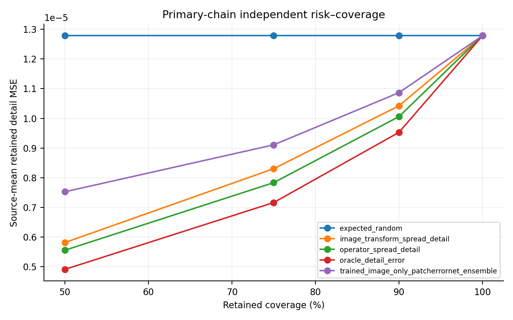
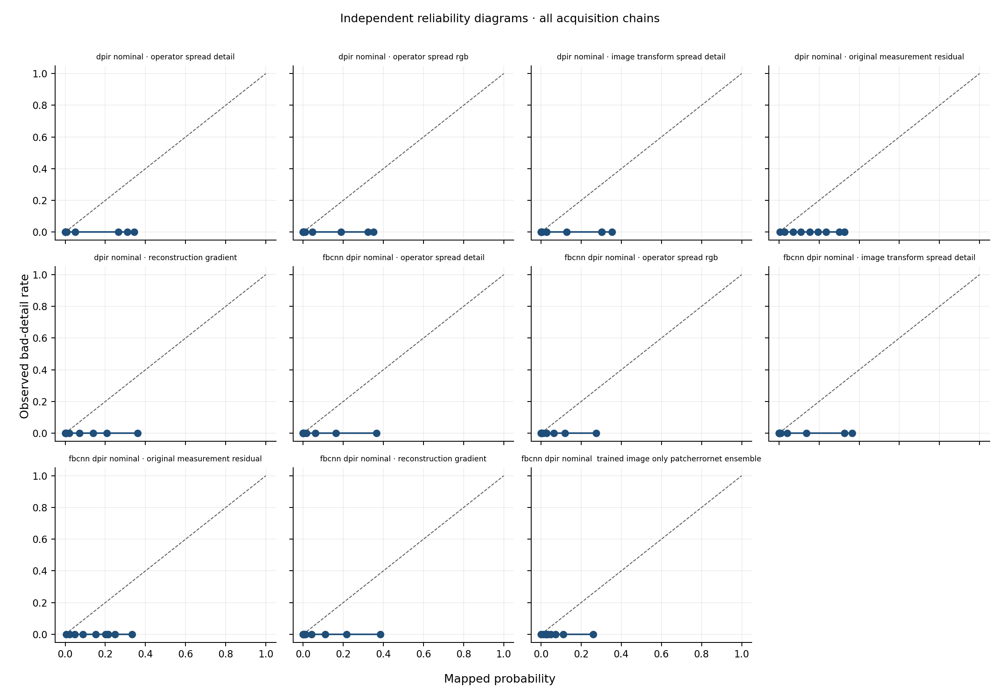

# Acquisition-Chain-Aware Reconstruction Under Forward-Model Mismatch: Locked Independent Evidence for JPEG Deblocking and Reliability Limits

**Journal-neutral manuscript, evidence-locked version — 25 September 2026**

## Abstract

Image reconstruction systems are commonly evaluated under the forward model assumed by the solver, although deployed acquisition chains may also contain compression, quantisation, resampling, and parameter drift. This mismatch can make a reconstruction appear plausible while its fine detail is weakly supported by the observation. We evaluated two bounded questions under a protocol frozen before independent test performance was inspected: whether JPEG-aware preprocessing improves reconstruction when JPEG compression is omitted from the inverse model, and whether operator-sensitive uncertainty improves selective retention beyond image-transform uncertainty. Forty sealed TESTIMAGES sources were centre-cropped and evaluated across seven acquisition chains comprising one uncompressed control and six JPEG conditions. Development data alone were used for method selection and reliability fitting. The primary reconstruction contrast compared nominal DPIR with FBCNN followed by nominal DPIR on the `j75_b16_n2` chain. The primary selection contrast compared operator-spread and image-transform-spread scores at 50% retained coverage. Source-paired bootstrap intervals used 10,000 replicates; one-sided paired sign-flip tests used 100,000 randomisations, with Holm correction across the two hypotheses. FBCNN plus DPIR reduced source-level detail mean-squared error by 90.13% relative to DPIR alone (absolute difference, -1.1674e-04; 95% bootstrap interval, -1.6701e-04 to -7.4384e-05; Holm-adjusted *p* = 1.99998e-05), passing the predeclared statistical and 5% practical gates. Reductions occurred on all six JPEG chains (17.81%–98.01%), whereas the uncompressed control changed by -2.53%. At 50% coverage, operator spread reduced retained-patch detail risk by 4.46% (absolute difference, -2.5957e-07; 95% interval, -5.1361e-07 to -8.9845e-08; Holm-adjusted *p* = 1.99998e-05). This effect was statistically detectable but failed the locked 5% practical gate. Across 286,720 held-out patch observations nested within the 40 sources, the predeclared event—centre-patch detail RMSE greater than 0.05—had zero positives, although it occurred in 22.16% of development-calibration patches. Positive-event calibration was not estimable. The evidence supports an acquisition-chain-specific reconstruction contribution and a transparent reliability assessment, not the original unified selective-reconstruction claim.

**Keywords:** inverse problems; forward-model mismatch; image reconstruction; JPEG artifact removal; selective prediction; uncertainty quantification; calibration; reproducibility

## 1. Introduction

Computational image reconstruction estimates an unknown image from measurements produced by a forward process. Modern approaches often combine an explicit observation model with a learned prior or denoiser, as in plug-and-play reconstruction and DPIR [1]. Their flexibility does not remove a fundamental dependency: data-consistency updates are only as appropriate as the model supplied to them. If the deployed chain includes an unmodelled stage, the solver may enforce consistency with the wrong process.

Forward-model mismatch is not an edge case. Optical parameters can be estimated inaccurately, acquisition geometry can drift, and a digital processing stage can intervene between the physical measurement and the stored image. Learned reconstruction can also be unstable under small perturbations or structural changes [4–6]. In this setting, perceptual plausibility is not equivalent to observation-supported recovery, and a low residual under the assumed operator need not establish fidelity to the latent reference [6,7].

JPEG compression is a concrete example of a missing acquisition stage. Its blockwise transform, quantisation, and decoding artifacts do not reduce to the additive Gaussian noise and blur commonly represented by a nominal inverse model. FBCNN was designed for flexible blind JPEG artifact removal and estimates an adjustable quality factor before reconstruction [2]. This suggests a simple serial intervention: explicitly repair the missing digital stage before applying an inverse solver. The intervention is not proposed as a new deblocking architecture. The research question is whether this composition produces an acquisition-chain-specific benefit under an independently locked comparison.

A second deployment question concerns selective release. When only a fraction of patches can be retained, a score should rank high-error regions ahead of lower-error regions. Joint image/operator inference and blind diffusion methods demonstrate that operator uncertainty can be represented [11,12,18], while distribution-free and conformal methods show how predictive uncertainty can be calibrated under stated conditions [13,14,17]. Those precedents do not imply that an operator-sensitive score will deliver a practically important advantage after model selection or under an omitted acquisition process. That advantage requires direct, held-out testing.

This study therefore separates reconstruction, selection, and calibration claims. We make four contributions:

1. a one-time, locked independent comparison of JPEG-aware preprocessing followed by nominal DPIR against nominal DPIR alone;
2. a seven-chain analysis that distinguishes compressed conditions from an uncompressed control;
3. a confirmatory comparison of operator-spread and image-transform-spread selection using both statistical and practical gates; and
4. an auditable account of a failed calibration target, where the locked positive event did not occur in the independent sample.

The intended contribution is methodological and evaluative. It is not a claim that FBCNN, DPIR, blind operator inference, uncertainty estimation, or conformal calibration is individually novel.

## 2. Related work and novelty boundary

### 2.1 Reconstruction under operator mismatch

Model error has been addressed through robust unrolling, learned correction, joint optimisation, and posterior sampling. Nan and Ji explicitly model kernel uncertainty in deconvolution [4], while Zeng and Lam study learned robustness to model mismatch in lensless imaging [5]. Diffusion-based approaches extend the design space: DDRM and diffusion posterior sampling solve inverse problems with pretrained generative priors [9,10], and parallel operator/image diffusion and GibbsDDRM perform blind joint inference within specified operator families [11,12]. Learned residual models can also compensate for discrepancies between an approximate differentiable operator and the true process [16]. These studies establish that mismatch handling and joint image/operator inference are occupied areas. They also motivate a distinction between uncertainty within a specified operator family and an omitted operation outside the solver’s nominal model.

### 2.2 Blind and compound image restoration

Blind and all-in-one restoration systems learn to respond to multiple unknown corruptions without explicitly recovering a physical operator [8]. Such systems can deliver strong perceptual restoration, but their outputs and information budgets differ from a reconstruction pipeline that retains an explicit data-consistency model. JPEG artifact removal is likewise well developed. FBCNN predicts a quality factor and uses it to control the artifact-removal/detail-preservation trade-off [2]. The present work uses that pretrained capability as a component, not as a claimed algorithmic contribution. The novelty question is narrower: whether explicit repair of the missing codec stage changes the outcome of a nominal inverse solver in a controlled acquisition-chain experiment.

### 2.3 Reliability, selective prediction, and calibration

Imaging uncertainty can be represented through posterior samples, intervals, conformal sets, or task-specific risk controls [13,14,17]. Distribution-free guarantees are tied to their target, exchangeability conditions, and calibration design. They do not automatically transfer to a different acquisition distribution, to post-selection risk, or to a rare failure event. Similarly, a ranking score can improve a risk–coverage curve without being a calibrated probability. We therefore evaluate selection and calibration separately: H2 concerns retained-patch risk at a fixed coverage, whereas calibration concerns a predeclared binary bad-detail event.

### 2.4 Rapid evidence map and claim scope

An AI-assisted seed evidence map was locked as an internal record on 15 September 2026 to identify relevant precedents and limit novelty claims. The internal record contains 90 assessed items, including 81 classified as peer-reviewed and 62 coded as close competitors; formal systematic-search accounting and complete human adjudication have not been established. It is a provisional rapid map, not a systematic review or evidence of exhaustive retrieval. The cited studies establish precedents for mismatch handling, blind image/operator inference, restoration with multiple corruptions, diffusion priors, and uncertainty estimation [4–18]. The contribution claimed here rests on the bounded acquisition-chain experiment. The statistical and practical gates improve interpretability but are not presented as a new algorithm.

## 3. Materials and methods

### 3.1 Study design

The programme used development-only selection followed by a one-time independent evaluation. Reconstruction configurations were selected on development sources. The learned image-only PatchErrorNet ensemble and score-to-probability mappings were fitted using development data only. The 40 independent source images were processed in five computational shards, which remained sealed during method development and were analysed once after every shard passed manifest checks. The shards were not sampling units.

The confirmatory analysis contained two hypotheses. H1 tested reconstruction fidelity; H2 tested selective risk. The endpoints, primary chain, coverage, practical thresholds, bootstrap procedure, randomisation test, and multiplicity correction were fixed before independent performance was inspected. Secondary chains and additional comparators were explicitly descriptive. A separate four-source development diagnostic informed protocol construction but used different reconstruction settings, crops, noise levels, pixel-selection endpoints and RGB MSE controls; it was neither independent evidence nor pooled with Experiment 05.

### 3.2 Independent images and evaluation region

The independent sample comprised 40 eight-bit RGB natural images from the 2400 x 2400 TESTIMAGES sampling archive [3]. Each decoded source was verified by filename, byte count, file SHA-256, and decoded-RGB SHA-256. A centred 576 x 576 crop was extracted from each source. A 32-pixel context border was retained for reconstruction, leaving a 512 x 512 interior for primary evaluation. The interior was divided into non-overlapping 16 x 16 patches, yielding 1,024 patches per image and chain.

This produced 280 source–chain observations across seven chains, 1,680 source–chain–method quality rows, 33,600 risk rows, and 286,720 patch rows for the calibration analysis. The 286,720 patch observations were nested within 40 source images; the source, not the patch or computational shard, was the independent inferential unit.

### 3.3 Acquisition chains

The seven locked chains are listed in Table 1. Chain identifiers encode the digital stage (`q8` for the uncompressed eight-bit control and `jXX` for JPEG quality), Gaussian blur standard deviation (`b12`, `b16`, or `b20` denoting 1.2, 1.6, or 2.0 pixels), and additive-noise standard deviation (`n2` or `n5` denoting 2/255 or 5/255). The primary chain was `j75_b16_n2`. The design varied JPEG quality, blur, and noise around that chain while retaining an uncompressed control at the same nominal blur and noise.

**Table 1. Locked independent acquisition chains.**

| Chain | Digital stage | Blur sigma | Noise SD | Role |
| --- | --- | ---: | ---: | --- |
| `q8_b16_n2` | Eight-bit, no JPEG | 1.6 | 2/255 | Uncompressed control |
| `j90_b16_n2` | JPEG quality 90 | 1.6 | 2/255 | Mild compression |
| `j75_b12_n2` | JPEG quality 75 | 1.2 | 2/255 | Blur variation |
| `j75_b16_n2` | JPEG quality 75 | 1.6 | 2/255 | Confirmatory primary chain |
| `j75_b20_n2` | JPEG quality 75 | 2.0 | 2/255 | Blur variation |
| `j75_b16_n5` | JPEG quality 75 | 1.6 | 5/255 | Noise variation |
| `j50_b16_n2` | JPEG quality 50 | 1.6 | 2/255 | Strong compression |

### 3.4 Reconstruction conditions

Nominal DPIR used a deep denoiser prior within a model-based iterative reconstruction framework [1]. Its supplied forward model represented the nominal blur/noise process but not the JPEG codec. The serial condition first applied pretrained FBCNN deblocking [2] and then applied the same nominal DPIR configuration. Thus, H1 isolated the effect of treating the missing compression stage before inversion while holding the downstream solver fixed.

The confirmatory endpoint was mean detail MSE on the 512 x 512 interior. Detail error was computed from the locked high-frequency representation used throughout development and independent analysis. Source-level values were formed before inference; patch-level observations were not treated as independent replicates.

### 3.5 Reliability scores and selective retention

Selection ranked 16 x 16 patches from lower to higher predicted risk and retained the lowest-risk fraction. The primary operational scores were:

- **operator-spread detail:** variation in reconstructed detail across the predefined plausible operator perturbations;
- **image-transform-spread detail:** variation in reconstructed detail under the predefined image-transform perturbations; and
- **trained image-only PatchErrorNet ensemble:** a development-fitted learned comparator that used reconstructed-image information without operator spread.

Expected random retention and the true patch-detail error were evaluation-only lower-information and oracle references, respectively. They were not deployable competitors. The primary H2 endpoint was source-level retained-patch detail MSE on `j75_b16_n2` at 50% coverage, comparing operator spread with image-transform spread. Risk–coverage curves at 50%, 75%, 90%, and 100% coverage were descriptive beyond that locked contrast.

### 3.6 Calibration target

Development-fitted mappings converted each score to a predicted probability of a locked bad-detail event: centre 16 x 16 patch detail RMSE greater than 0.05. Independent reliability diagrams, source-macro Brier scores, equal-mass expected calibration error, calibration-in-the-large, and calibration slopes were computed where estimable. No confirmatory pairwise calibration-superiority test was predeclared. Brier and expected-calibration-error rankings were therefore descriptive.

### 3.7 Statistical analysis

For each hypothesis, the source-level paired difference was defined so that a negative value favoured the proposed condition. Two requirements had to pass:

1. a one-sided paired sign-flip test after Holm correction across H1 and H2; and
2. at least 5% relative reduction against the locked comparator.

Paired source-bootstrap intervals used 10,000 replicates. Sign-flip tests used 100,000 randomisations and the continuity correction `(extreme + 1)/(randomisations + 1)`. With zero more-extreme randomisations, the minimum attainable unadjusted value was 9.99990e-06. The combined experimental gate required both H1 and H2 to pass; a significant result alone could not replace the practical threshold. The 5% relative-reduction margins were chosen after the four-source development diagnostic and before any independent test outcome was inspected. They are study-specific, development-informed decision margins, not universal definitions of utility.

### 3.8 Integrity and reproducibility

All five independent inference shards, the Stage 05E analysis package, and the Stage 05F synthesis package were verified against embedded byte counts and SHA-256 manifests. The analysis consumed sealed outputs and produced immutable claim decisions. The repository contains clean notebooks, compact result tables, figures, manifests, and validation code; large sealed archives and executed notebooks are linked by canonical hashes rather than committed as mutable research files.

## 4. Results

### 4.1 Independent data and audit completion

All 40 sources and seven acquisition chains were present. All five inference shards passed archive, manifest, and file-hash checks before analysis. The one-time analysis therefore included the complete intended independent sample; no source or chain was removed after performance inspection.

### 4.2 H1: JPEG-aware preprocessing passed the reconstruction gate

On the primary `j75_b16_n2` chain, nominal DPIR had mean source-level detail MSE 1.2952713644e-04. FBCNN followed by nominal DPIR reduced the mean to 1.2783605060e-05, a relative reduction of 90.1306%. The paired absolute difference was -1.1674353138e-04, with a 95% source-bootstrap interval from -1.6701316322e-04 to -7.4384088950e-05. The one-sided sign-flip value was 9.99990e-06 and the Holm-adjusted value was 1.99998e-05. H1 passed both its statistical requirement and the locked 5% practical threshold (Table 2).

**Table 2. Confirmatory independent results. Negative differences favour the proposed condition.**

| Hypothesis | Comparator mean | Proposed mean | Mean difference (95% bootstrap interval) | Relative reduction | Holm-adjusted *p* | Locked decision |
| --- | ---: | ---: | ---: | ---: | ---: | --- |
| H1: FBCNN + DPIR vs DPIR detail MSE | 1.29527e-04 | 1.27836e-05 | -1.16744e-04 (-1.67013e-04, -7.43841e-05) | 90.13% | 1.99998e-05 | Passed |
| H2: operator vs image-transform spread risk | 5.81473e-06 | 5.55516e-06 | -2.59572e-07 (-5.13609e-07, -8.98451e-08) | 4.46% | 1.99998e-05 | Statistical gate passed; 5% practical gate failed |

The secondary chain pattern supported an acquisition-chain-specific interpretation (Table 3; Figure 1). FBCNN plus DPIR reduced detail MSE on every JPEG chain, with reductions from 17.81% to 98.01%. On the uncompressed control, the serial pipeline increased detail MSE by 2.53%. The largest gains occurred under quality-75 and quality-50 compression; the mild quality-90 chain showed a smaller but positive benefit.

**Table 3. Descriptive reconstruction effect across acquisition chains.**

| Chain | DPIR mean detail MSE | FBCNN + DPIR mean detail MSE | Relative reduction |
| --- | ---: | ---: | ---: |
| `q8_b16_n2` | 1.10712e-05 | 1.13508e-05 | -2.53% |
| `j90_b16_n2` | 1.42294e-05 | 1.16954e-05 | 17.81% |
| `j75_b12_n2` | 1.76194e-04 | 8.33292e-06 | 95.27% |
| `j75_b16_n2` | 1.29527e-04 | 1.27836e-05 | 90.13% |
| `j75_b20_n2` | 1.01176e-04 | 1.82527e-05 | 81.96% |
| `j75_b16_n5` | 6.05437e-04 | 6.02582e-05 | 90.05% |
| `j50_b16_n2` | 7.28797e-04 | 1.44945e-05 | 98.01% |

### 4.3 H2: operator-spread selection was statistically detectable but practically subthreshold

At 50% coverage on `j75_b16_n2`, image-transform spread produced mean retained-patch detail MSE 5.8147345352e-06. Operator spread reduced this to 5.5551623283e-06. The 4.4640% reduction corresponded to an absolute difference of -2.5957220687e-07, with a 95% source-bootstrap interval from -5.1360919150e-07 to -8.9845112734e-08. The statistical requirement passed, but the effect was 0.53596 percentage points below the predeclared 5% practical threshold. H2 therefore failed, and the combined experimental gate did not pass.

At the same coverage, the oracle risk was 4.91010e-06, the learned image-only PatchErrorNet ensemble risk was 7.52514e-06, and expected random retention risk was 1.27836e-05 (Table 4). Operator spread ranked between the oracle and image-transform spread, whereas the trained image-only comparator underperformed both hand-constructed operational scores. These are descriptive comparisons and do not change the H2 decision.

**Table 4. Detail risk at 50% coverage on the primary chain.**

| Ranking score | Role | Mean retained-patch detail MSE | Interpretation |
| --- | --- | ---: | --- |
| Oracle true detail error | Evaluation only | 4.91010e-06 | Unavailable upper benchmark for ranking |
| Operator-spread detail | Operational | 5.55516e-06 | H2 proposed score |
| Image-transform-spread detail | Operational | 5.81473e-06 | H2 comparator |
| PatchErrorNet ensemble | Operational, development-fitted | 7.52514e-06 | Learned image-only comparator |
| Expected random retention | Evaluation only | 1.27836e-05 | No-information reference |

### 4.4 Positive-event calibration was not estimable

None of the 286,720 held-out patch observations, nested within 40 independent source images, exceeded the locked event threshold of centre-patch detail RMSE greater than 0.05. In contrast, a retrospective development-only audit found 50,824 positives among 229,376 development-calibration patch observations (22.16%), with positives in all 32 development-calibration sources (Supplementary Table S1). Thus the threshold had development support, while this independent cohort had no positive-event support. This is an observed event-prevalence shift; its cause and the score's ability to detect positives under external shift cannot be established here. Sensitivity, discrimination, positive-event calibration, and a meaningful calibration slope were not estimable. Non-zero mapped probabilities overpredicted the event in this sample. Brier scores remained numerically computable but mainly reflected predictions against an all-zero outcome.

## 5. Discussion

### 5.1 Principal finding: the missing acquisition stage mattered

The clearest result is an interaction between preprocessing and the acquisition chain. The serial pipeline produced large improvements when JPEG compression was present but no improvement on the uncompressed control. This pattern is more informative than an average across all chains: it supports the mechanism that deblocking repairs a specific omitted digital stage before the nominal inverse solver is applied. It does not imply that deblocking is universally beneficial, that the serial composition is a new architecture, or that DPIR is generally robust to arbitrary model error.

The magnitude varied substantially, from 17.81% at JPEG quality 90 to more than 90% in several harsher chains. This variation is consistent with a stage whose relevance depends on compression severity and its interaction with blur and noise. The -2.53% control result is particularly important because it rules against interpreting FBCNN as a generic improvement applied indiscriminately to every observation.

### 5.2 Why H2 remains a negative confirmatory result

Operator spread improved selective ranking relative to image-transform spread, and the paired interval excluded zero. Nevertheless, the protocol required both statistical evidence and a minimum 5% relative reduction. The observed 4.4640% did not meet that study-specific requirement; this does not show that the improvement has no practical value in every setting. Rounding it to 5%, lowering the margin after seeing the result, or elevating descriptive comparisons would invalidate the locked decision.

The result is still scientifically useful. Operator spread was closer to the oracle than image-transform spread and outperformed the trained image-only ensemble at 50% coverage. This supports further development of operator-sensitive ranking, but only as a new hypothesis. Any future test should be preregistered with a clinically or operationally justified effect size, a new independent sample, and a clear distinction between exploratory tuning and confirmatory evidence.

### 5.3 Calibration must be supported by events

The 0.05 event occurred in every development-calibration source but not once in the independent cohort. This supports an event-support shift between development and TESTIMAGES, without identifying its cause or proving that the threshold was incorrectly chosen. With no independent positives, a low Brier score may simply reward predictions near zero; it cannot show that high-risk patches would be identified when they occur. A horizontal reliability diagram is likewise not evidence of perfect calibration when predictions are non-zero and outcomes have no variation.

A retrospective development-only threshold audit found positive-event prevalences of 51.36% at RMSE 0.025, 22.16% at the locked 0.05, and 1.14% at 0.10 (Supplementary Table S1). These rates do not make an alternative threshold confirmatory for Stage 05. Future work should define the event by an operational consequence, plan for support under external shift, and assess continuous or severity-stratified error in a new frozen experiment. No threshold sensitivity analysis changes the Stage 05E decision.

### 5.4 Relationship to prior work

Our result complements, rather than supersedes, robust unrolling and blind posterior methods [4,5,11,12]. Those methods address uncertain parameters or learn discrepancy within their own assumptions. Here, the strongest evidence came from explicitly treating a known class of missing digital operation before applying a nominal solver. The work also differs from all-in-one restoration [8]: the central evidence is a controlled acquisition-chain contrast with an uncompressed control and a locked inferential decision, not perceptual performance across a broad restoration suite.

The reliability result likewise narrows the contribution. Operator-conditioned variability is motivated by blind image/operator inference, but its selective advantage did not cross the practical gate. Conformal and distribution-free imaging methods [13,14,17] remain the appropriate reference point for formal coverage claims; this study does not claim such a guarantee under shift. Instead, it demonstrates why ranking, calibration, and practical utility must be assessed as separate questions.

### 5.5 Publication claim

The original claim of an evidence-calibrated operator-sensitive selective-reconstruction method was not established. The unified manuscript instead reports a large chain-specific reconstruction result together with its reliability boundary: a statistically detectable selection gain below the predeclared practical margin and a positive-event target unsupported in the independent cohort. Predeclared gates make this account credible, but good statistical discipline alone is not claimed as the principal methodological novelty. External-source replication, solver transfer, an alternate acquisition stage, and a genuinely new chain-aware reliability score remain hypotheses for Stage 06.

## 6. Limitations

First, the independent sample contained 40 natural-image sources from one public archive and seven simulated chains. It does not establish transfer to new sensors, real camera pipelines, or other modalities. Second, the analysis used centre crops and a detail-MSE endpoint; perceptual quality and downstream task utility may rank methods differently. Third, the serial intervention was evaluated with FBCNN and one nominal DPIR configuration, so the result does not isolate every architectural or hyperparameter interaction. Fourth, the operator-spread score was evaluated at one confirmatory chain and coverage; other coverages are descriptive. Fifth, although the 0.05 event was supported in development calibration, zero independent positives prevented validation of positive-event probabilities or discrimination; the reason for this distribution difference is unknown. Sixth, the AI-assisted seed evidence map is provisional, with incomplete systematic-search accounting and human adjudication. Finally, the study does not support forensic recovery, hallucination-free reconstruction, or guaranteed abstention.

## 7. Conclusion

Under a locked independent protocol, JPEG-aware FBCNN preprocessing before nominal DPIR substantially reduced detail error across compressed acquisition chains and provided no benefit on the uncompressed control. This supports a specific acquisition-chain interpretation: explicitly treating an omitted codec stage can matter more than asking the inverse solver to absorb that mismatch. Operator-spread selection produced a statistically detectable 4.46% reduction in retained-patch detail risk, but it did not meet the predeclared 5% practical threshold. Positive-event calibration could not be established because the locked bad-detail event occurred in development calibration but never in the independent cohort. The defensible conclusion is therefore bounded: the reconstruction result is independently supported within the seven-chain experiment, while the stronger selective-reliability claim remains unproven.

## Reproducibility and data availability

The public repository provides clean analysis notebooks, validation scripts, compact result tables, figures, archive receipts, the claim-decision record, and the evidence-locked manuscript source. Large sealed inference shards, original Stage 05E/05F archives, and executed notebook copies are retained as immutable external research records; their canonical SHA-256 identifiers are recorded in the Stage 05 final checkpoint. TESTIMAGES source files remain governed by their original distribution terms and are not redistributed by the project.

## References

1. Zhang K, Li Y, Zuo W, Zhang L, Van Gool L, Timofte R. Plug-and-play image restoration with deep denoiser prior. *IEEE Transactions on Pattern Analysis and Machine Intelligence*. 2022;44(10):6360–6376. doi:10.1109/TPAMI.2021.3088914.
2. Jiang J, Zhang K, Timofte R. Towards flexible blind JPEG artifacts removal. In: *Proceedings of the IEEE/CVF International Conference on Computer Vision*. 2021:4997–5006. doi:10.1109/ICCV48922.2021.00495.
3. Asuni N, Giachetti A. TESTIMAGES: a large data archive for display and algorithm testing. *Journal of Graphics Tools*. 2015;17(4):113–125. doi:10.1080/2165347X.2015.1024298.
4. Nan Y, Ji H. Deep learning for handling kernel/model uncertainty in image deconvolution. In: *Proceedings of the IEEE/CVF Conference on Computer Vision and Pattern Recognition*. 2020. doi:10.1109/CVPR42600.2020.00246.
5. Zeng T, Lam EY. Robust reconstruction with deep learning to handle model mismatch in lensless imaging. *IEEE Transactions on Computational Imaging*. 2021;7. doi:10.1109/TCI.2021.3114542.
6. Antun V, Renna F, Poon C, Adcock B, Hansen AC. On instabilities of deep learning in image reconstruction and the potential costs of AI. *Proceedings of the National Academy of Sciences*. 2020;117(48):30088–30095. doi:10.1073/pnas.1907377117.
7. Bhadra S, Kelkar VA, Brooks FJ, Anastasio MA. On hallucinations in tomographic image reconstruction. *IEEE Transactions on Medical Imaging*. 2021;40(11):3249–3260. doi:10.1109/TMI.2021.3077857.
8. Li B, Liu X, Hu P, Wu Z, Lv J, Peng X. All-in-one image restoration for unknown corruption. In: *Proceedings of the IEEE/CVF Conference on Computer Vision and Pattern Recognition*. 2022.
9. Kawar B, Elad M, Ermon S, Song J. Denoising diffusion restoration models. In: *Advances in Neural Information Processing Systems*. 2022;35.
10. Chung H, Kim J, McCann MT, Klasky ML, Ye JC. Diffusion posterior sampling for general noisy inverse problems. In: *International Conference on Learning Representations*. 2023.
11. Chung H, Kim J, McCann MT, Klasky ML, Ye JC. Parallel diffusion models of operator and image for blind inverse problems. In: *Proceedings of the IEEE/CVF Conference on Computer Vision and Pattern Recognition*. 2023.
12. Murata N, Saito K, Lai CJ, Takida Y, Uesaka T, Mitsufuji Y, Ermon S. GibbsDDRM: a partially collapsed Gibbs sampler for solving blind inverse problems with denoising diffusion restoration. In: *Proceedings of the 40th International Conference on Machine Learning*. 2023.
13. Angelopoulos AN, Kohli AP, Bates S, Jordan MI, Malik J, Alshaabi T, Upadhyayula S, Romano Y. Image-to-image regression with distribution-free uncertainty quantification and applications in imaging. In: *Proceedings of the 39th International Conference on Machine Learning*. 2022.
14. Teneggi J, Tivnan M, Stayman JW, Sulam J. How to trust your diffusion model: a convex optimization approach to conformal risk control. In: *Proceedings of the 40th International Conference on Machine Learning*. 2023.
15. Renaud M, Prost J, Leclaire A, Papadakis N. Plug-and-play posterior sampling under mismatched measurement and prior models. In: *International Conference on Learning Representations*. 2024.
16. Lee C, Jang M. Mitigating forward model mismatch in inverse problems via learned residuals and diffusion priors. In: *Proceedings of SPIE*. 2026;14016:140160D. doi:10.1117/12.3098133.
17. Everink JM, Dong Y, Andersen MS. Self-supervised conformal prediction for uncertainty quantification in imaging problems. In: *Scale Space and Variational Methods in Computer Vision*. 2025. doi:10.1007/978-3-031-92366-1_9.
18. Laroche C, Almansa A, Coupete E. Fast Diffusion EM: a diffusion model for blind inverse problems with application to deconvolution. In: *Proceedings of the IEEE/CVF Winter Conference on Applications of Computer Vision*. 2024.

## Supplementary development threshold sensitivity

Supplementary Table S1 is a retrospective, development-only analysis of 32 held-out DIV2K calibration sources (229,376 patch observations). Patch prevalences describe event support; 95% intervals resample sources. These results do not alter the locked 0.05 Stage 05 endpoint or its independent decision. The [full threshold grid](../results/stage06a_development_threshold_sensitivity/threshold_summary.csv) and integrity receipt are retained in the repository.

**Supplementary Table S1. Development-calibration event support by detail RMSE threshold.**

| RMSE threshold | Positive patches / 229,376 | Patch prevalence | 95% source-bootstrap interval | Sources with positives |
| ---: | ---: | ---: | ---: | ---: |
| 0.025 | 117,803 | 51.36% | 41.27%–60.88% | 32/32 |
| **0.050 (locked)** | **50,824** | **22.16%** | **14.83%–29.81%** | **32/32** |
| 0.100 | 2,605 | 1.14% | 0.42%–2.10% | 20/32 |
