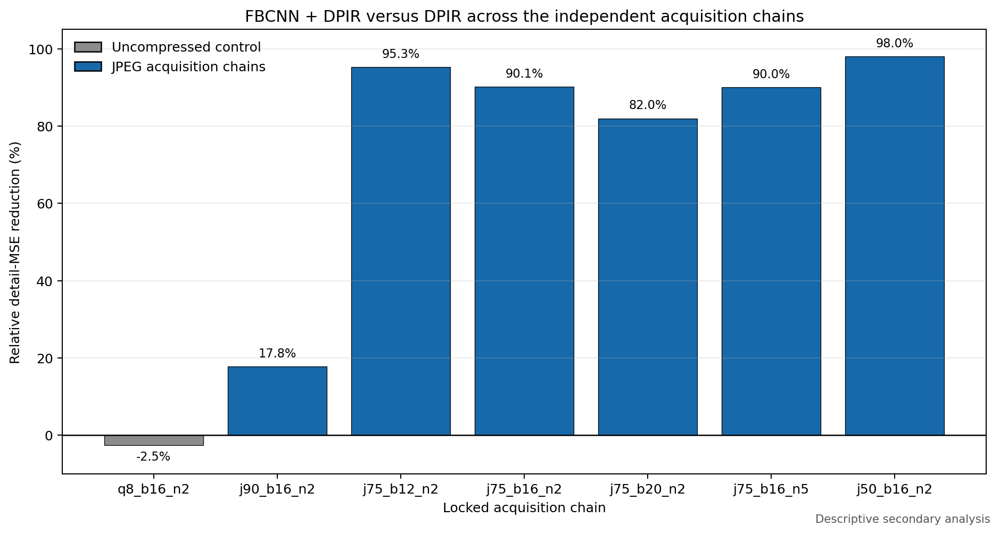
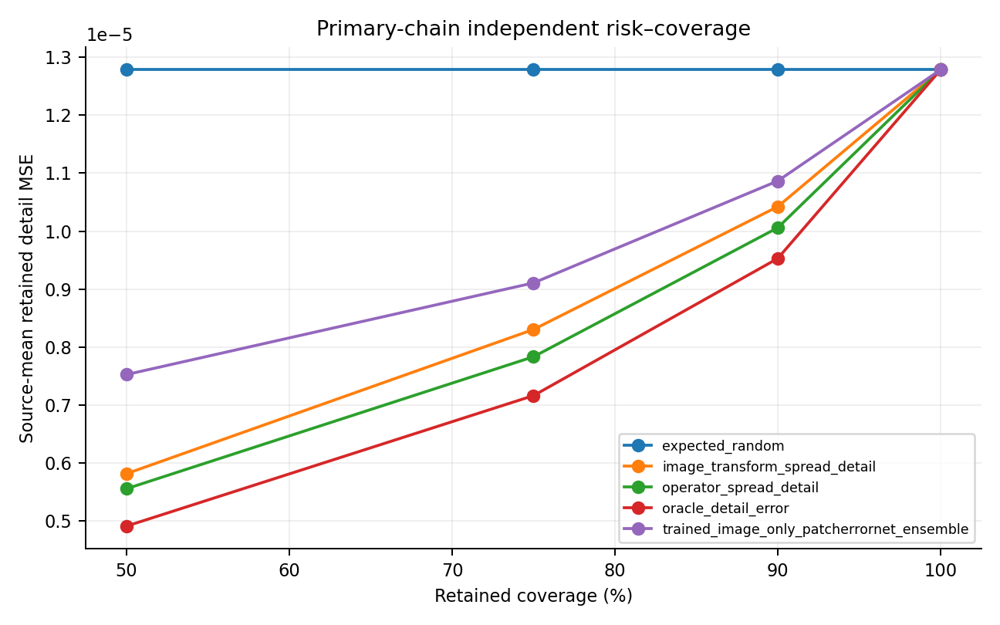
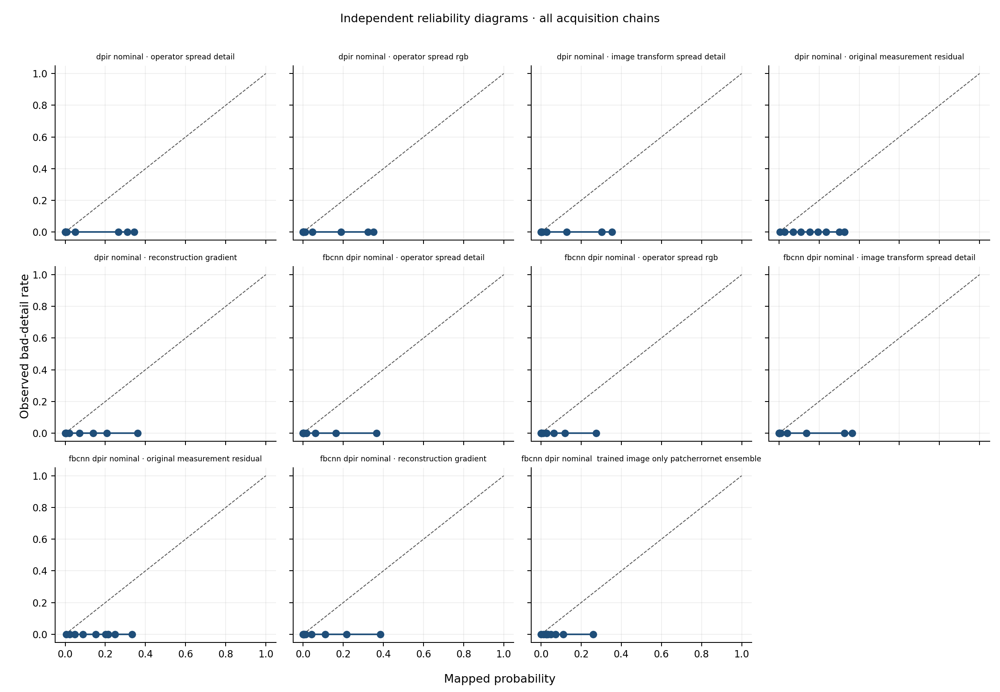

# Acquisition-Chain-Aware Reconstruction and Reliability Under Forward-Model Mismatch: Two Locked Independent Evaluations

**Journal-neutral unified manuscript, Stage 05 and Stage 06F evidence — 27 September 2026**

## Abstract

Image reconstruction systems are commonly evaluated under a solver's assumed forward model, although acquisition chains may contain omitted digital stages. We report two separately frozen independent experiments. Stage 05 evaluated 40 TESTIMAGES sources across seven chains: FBCNN deblocking followed by nominal DPIR reduced primary-chain source detail MSE by 90.13% relative to nominal DPIR (95% source-bootstrap interval for the absolute difference, -1.6701e-04 to -7.4384e-05), passing its 5% practical gate. On the uncompressed control, the same intervention worsened detail MSE by 2.53%. Operator-spread selection reduced retained-patch risk by 4.46% but failed its separately locked 5% practical gate; the predeclared RMSE > 0.05 calibration event had no positives in 286,720 held-out patch rows. After these results, Stage 06 developed a chain-aware continuous detail-error predictor and independently evaluated it on 150 RAISE sources across two represented JPEG acquisition chains (43,200 held-out patch rows). Against a frozen residual-only predictor, source-macro MAE fell from 0.00285082 to 0.00243527, a 14.58% relative reduction; the mean paired gain was 0.00041555 (95% source-bootstrap interval 0.00027477 to 0.00058044), meeting the Stage 06 predeclared criterion of a positive lower bound. Severity events at RMSE > 0.0075 and > 0.01 were present. Development transfer to an unseen chain was adverse, so the independent reliability claim is limited to the two represented chains. These are distinct reconstruction, selective-risk, and prediction-error endpoints; Stage 06 does not revise Stage 05 decisions.

**Keywords:** inverse problems; forward-model mismatch; image reconstruction; JPEG artifact removal; selective prediction; uncertainty quantification; calibration; reproducibility

## 1. Introduction

Computational image reconstruction estimates an unknown image from measurements produced by a forward process. Modern approaches often combine an explicit observation model with a learned prior or denoiser, as in plug-and-play reconstruction and DPIR [1]. Their flexibility does not remove a fundamental dependency: data-consistency updates are only as appropriate as the model supplied to them. If the deployed chain includes an unmodelled stage, the solver may enforce consistency with the wrong process.

Forward-model mismatch is not an edge case. Optical parameters can be estimated inaccurately, acquisition geometry can drift, and a digital processing stage can intervene between the physical measurement and the stored image. Learned reconstruction can also be unstable under small perturbations or structural changes [4–6]. In this setting, perceptual plausibility is not equivalent to observation-supported recovery, and a low residual under the assumed operator need not establish fidelity to the latent reference [6,7].

JPEG compression is a concrete example of a missing acquisition stage. Its blockwise transform, quantisation, and decoding artifacts do not reduce to the additive Gaussian noise and blur commonly represented by a nominal inverse model. FBCNN was designed for flexible blind JPEG artifact removal and estimates an adjustable quality factor before reconstruction [2]. This suggests a simple serial intervention: explicitly repair the missing digital stage before applying an inverse solver. The intervention is not proposed as a new deblocking architecture. The research question is whether this composition produces an acquisition-chain-specific benefit under an independently locked comparison.

A second deployment question concerns selective release. When only a fraction of patches can be retained, a score should rank high-error regions ahead of lower-error regions. Joint image/operator inference and blind diffusion methods demonstrate that operator uncertainty can be represented [11,12,18], while distribution-free and conformal methods show how predictive uncertainty can be calibrated under stated conditions [13,14,17]. Those precedents do not imply that an operator-sensitive score will deliver a practically important advantage after model selection or under an omitted acquisition process. That advantage requires direct, held-out testing.

This study therefore separates reconstruction, selection, and calibration claims. We report:

1. a one-time, locked independent comparison of JPEG-aware preprocessing followed by nominal DPIR against nominal DPIR alone;
2. a seven-chain analysis that distinguishes compressed conditions from an uncompressed control;
3. a confirmatory comparison of operator-spread and image-transform-spread selection using both statistical and practical gates; and
4. an auditable account of a failed calibration target, where the locked positive event did not occur in the Stage 05 independent sample; and
5. a separately frozen, externally sourced Stage 06 evaluation of a chain-aware continuous detail-error predictor against a residual-only comparator, with positive severity-event support and a bounded two-chain claim.

The intended contribution is methodological and evaluative. It is not a claim that FBCNN, DPIR, blind operator inference, uncertainty estimation, or conformal calibration is individually novel.

## 2. Related work and novelty boundary

### 2.1 Reconstruction under operator mismatch

Model error has been addressed through robust unrolling, learned correction, joint optimisation, and posterior sampling. Nan and Ji explicitly model kernel uncertainty in deconvolution [4], while Zeng and Lam study learned robustness to model mismatch in lensless imaging [5]. Diffusion-based approaches extend the design space: DDRM and diffusion posterior sampling solve inverse problems with pretrained generative priors [9,10], and parallel operator/image diffusion and GibbsDDRM perform blind joint inference within specified operator families [11,12]. Plug-and-play posterior-sampling analysis has also examined mismatched measurement and prior models [15]. Learned residual models can compensate for discrepancies between an approximate differentiable operator and the true process [16]. These studies establish that mismatch handling and joint image/operator inference are occupied areas. They also motivate a distinction between uncertainty within a specified operator family and an omitted operation outside the solver’s nominal model.

### 2.2 Blind and compound image restoration

Blind and all-in-one restoration systems learn to respond to multiple unknown corruptions without explicitly recovering a physical operator [8]. Such systems can deliver strong perceptual restoration, but their outputs and information budgets differ from a reconstruction pipeline that retains an explicit data-consistency model. JPEG artifact removal is likewise well developed. FBCNN predicts a quality factor and uses it to control the artifact-removal/detail-preservation trade-off [2]. The present work uses that pretrained capability as a component, not as a claimed algorithmic contribution. The novelty question is narrower: whether explicit repair of the missing codec stage changes the outcome of a nominal inverse solver in a controlled acquisition-chain experiment.

### 2.3 Reliability, selective prediction, and calibration

Imaging uncertainty can be represented through posterior samples, intervals, conformal sets, or task-specific risk controls [13,14,17]. Distribution-free guarantees are tied to their target, exchangeability conditions, and calibration design. They do not automatically transfer to a different acquisition distribution, to post-selection risk, or to a rare failure event. Similarly, a ranking score can improve a risk–coverage curve without being a calibrated probability. We therefore evaluate selection and calibration separately: H2 concerns retained-patch risk at a fixed coverage, whereas calibration concerns a predeclared binary bad-detail event.

### 2.4 Rapid evidence-map boundary and claim scope

The 15 September 2026 snapshot contains 90 AI-assisted seed records, of which 81 were coded as peer-reviewed and 62 as closest competitors. Human adjudication and formal systematic-search accounting remain incomplete. This provisional rapid evidence map helps constrain our claims; it is not a systematic review and its counts do not establish comprehensive coverage. The cited primary competitors establish that broad “first method” claims for mismatch handling, blind inference, restoration, diffusion priors, or uncertainty estimation are unwarranted. Our narrower contribution concerns the independently evaluated acquisition-stage intervention and the separately frozen two-chain reliability predictor, including their measured boundaries.

## 3. Materials and methods

### 3.1 Study design

The programme used development-only selection followed by two separately frozen, one-time independent evaluations. Stage 05 reconstruction configurations were selected on development sources. The learned image-only PatchErrorNet ensemble and score-to-probability mappings were fitted using development data only. Five Stage 05 independent inference shards were computational partitions, not five experimental units; all 40 independent sources were analysed once, after shard completion and manifest checks. A separate four-source development diagnostic informed protocol construction but used different reconstruction settings, pixel-level endpoints and controls; it was not independent evidence and was not pooled with Stage 05 or Stage 06. The Stage 05 protocol's 5% margins were selected after that diagnostic and before independent outcomes were inspected.

Stage 05 confirmatory analysis contained two hypotheses. H1 tested reconstruction fidelity; H2 tested selective risk. Its endpoints, primary chain, coverage, practical thresholds, bootstrap procedure, randomisation test, and multiplicity correction were fixed before independent performance was inspected. Secondary chains and additional comparators were explicitly descriptive. Stage 06 is a distinct follow-up experiment with its own freeze and primary rule, described in Section 3.9; it does not reopen either Stage 05 hypothesis.

### 3.2 Independent images and evaluation region

The independent sample comprised 40 eight-bit RGB natural images from the 2400 x 2400 TESTIMAGES sampling archive [3]. Each decoded source was verified by filename, byte count, file SHA-256, and decoded-RGB SHA-256. A centred 576 x 576 crop was extracted from each source. A 32-pixel context border was retained for reconstruction, leaving a 512 x 512 interior for primary evaluation. The interior was divided into non-overlapping 16 x 16 patches, yielding 1,024 patches per image and chain.

This produced 280 source–chain observations across seven chains, 1,680 source–chain–method quality rows, 33,600 risk rows, and 286,720 patch rows for the calibration analysis. The source, not the patch, was the independent inferential unit.

### 3.3 Acquisition chains

The seven locked chains are listed in Table 1. Chain identifiers encode the digital stage (`q8` for the uncompressed eight-bit control and `jXX` for JPEG quality), Gaussian blur standard deviation (`b12`, `b16`, or `b20` denoting 1.2, 1.6, or 2.0 pixels), and additive-noise standard deviation (`n2` or `n5` denoting 2/255 or 5/255). The primary chain was `j75_b16_n2`. The design varied JPEG quality, blur, and noise around that chain while retaining an uncompressed control at the same nominal blur and noise.

**Table 1. Locked independent acquisition chains.**

| Chain | Digital stage | Blur sigma | Noise SD | Role |
| --- | --- | ---: | ---: | --- |
| `q8_b16_n2` | Eight-bit, no JPEG | 1.6 | 2/255 | Uncompressed control |
| `j90_b16_n2` | JPEG quality 90 | 1.6 | 2/255 | Mild compression |
| `j75_b12_n2` | JPEG quality 75 | 1.2 | 2/255 | Blur variation |
| `j75_b16_n2` | JPEG quality 75 | 1.6 | 2/255 | Confirmatory primary chain |
| `j75_b20_n2` | JPEG quality 75 | 2.0 | 2/255 | Blur variation |
| `j75_b16_n5` | JPEG quality 75 | 1.6 | 5/255 | Noise variation |
| `j50_b16_n2` | JPEG quality 50 | 1.6 | 2/255 | Strong compression |

### 3.4 Reconstruction conditions

Nominal DPIR used a deep denoiser prior within a model-based iterative reconstruction framework [1]. Its supplied forward model represented the nominal blur/noise process but not the JPEG codec. The serial condition first applied pretrained FBCNN deblocking [2] and then applied the same nominal DPIR configuration. Thus, H1 isolated the effect of treating the missing compression stage before inversion while holding the downstream solver fixed.

The confirmatory endpoint was mean detail MSE on the 512 x 512 interior. Detail error was computed from the locked high-frequency representation used throughout development and independent analysis. Source-level values were formed before inference; patch-level observations were not treated as independent replicates.

### 3.5 Reliability scores and selective retention

Selection ranked 16 x 16 patches from lower to higher predicted risk and retained the lowest-risk fraction. The primary operational scores were:

- **operator-spread detail:** variation in reconstructed detail across the predefined plausible operator perturbations;
- **image-transform-spread detail:** variation in reconstructed detail under the predefined image-transform perturbations; and
- **trained image-only PatchErrorNet ensemble:** a development-fitted learned comparator that used reconstructed-image information without operator spread.

Expected random retention and the true patch-detail error were evaluation-only lower-information and oracle references, respectively. They were not deployable competitors. The primary H2 endpoint was source-level retained-patch detail MSE on `j75_b16_n2` at 50% coverage, comparing operator spread with image-transform spread. Risk–coverage curves at 50%, 75%, 90%, and 100% coverage were descriptive beyond that locked contrast.

### 3.6 Calibration target

Development-fitted mappings converted each score to a predicted probability of a locked bad-detail event: centre 16 x 16 patch detail RMSE greater than 0.05. This threshold had development support: a development-only audit found 50,824 positives among 229,376 patch rows (22.16%) and positive events in all 32 development-calibration sources. At thresholds 0.02 and 0.03 the corresponding prevalences were 59.83% and 43.50%. The 0.05 confirmatory threshold remained unchanged after the independent outcome. Independent reliability diagrams, source-macro Brier scores, equal-mass expected calibration error, calibration-in-the-large, and calibration slopes were computed where estimable. No confirmatory pairwise calibration-superiority test was predeclared. Brier and expected-calibration-error rankings were therefore descriptive.

### 3.7 Statistical analysis

For each hypothesis, the source-level paired difference was defined so that a negative value favoured the proposed condition. Two requirements had to pass:

1. a one-sided paired sign-flip test after Holm correction across H1 and H2; and
2. at least 5% relative reduction against the locked comparator.

Paired source-bootstrap intervals used 10,000 replicates. Sign-flip tests used 100,000 randomisations and the continuity correction `(extreme + 1)/(randomisations + 1)`. With zero more-extreme randomisations, the minimum attainable unadjusted value was 9.99990e-06. The combined experimental gate required both H1 and H2 to pass; a significant result alone could not replace the practical threshold.

### 3.8 Integrity and reproducibility

All five independent inference shards, the Stage 05E analysis package, and the Stage 05F synthesis package were verified against embedded byte counts and SHA-256 manifests. The analysis consumed sealed outputs and produced immutable claim decisions. The repository contains clean notebooks, compact result tables, figures, manifests, and validation code; large sealed archives and executed notebooks are linked by canonical hashes rather than committed as mutable research files.

### 3.9 Stage 06: external-source reliability evaluation

The subsequent Stage 06 experiment used audited RAISE camera-native sources [19] allocated before independent inference: 495 development-fit, 150 development-early-stop, 149 development-calibration, 50 external-pilot and 150 independent-test sources. Both frozen chains included JPEG quality 75, blur sigma 1.6 and noise SD 2/255, differing in linear-light versus sRGB acquisition response. Each independent source supplied 144 patches per chain. RAISE was not used for the Stage 06C solver sanity checks. Development compared DPIR, a classical gradient-inverse candidate, and DiffPIR. DiffPIR performed poorly on the linear-light development chain and was excluded before the reliability freeze; the final Stage 06F endpoint predicts DPIR reconstruction detail RMSE. The gradient-inverse candidate contributed development-time solver diagnostics, but the sealed output does not establish a confirmatory second-solver reconstruction effect.

The proposed gradient-boosting chain-aware score used forward-consistency residual, cross-chain disagreement and solver uncertainty to predict centre-patch detail RMSE. The frozen residual-only ridge score was the primary comparator. Fitting used development-fit sources only, hyperparameters were selected with early-stop sources, and event-probability mappings used calibration sources. The 50-source external pilot was inspected adaptively and was excluded from fitting and confirmatory inference. Development leave-one-chain-out diagnostics showed adverse transfer, most notably when training on sRGB and evaluating linear-light; consequently, the subsequent confirmatory population was explicitly limited to the two chains represented during training.

The Stage 06E signed freeze fixed the model and source allocation before the single Stage 06F independent run. For each source, absolute prediction errors were averaged across both chains' 288 patches; the primary paired gain was residual-only source MAE minus chain-aware source MAE. The mean of 150 source gains passed only if the lower bound of a two-sided 95% source-bootstrap percentile interval exceeded zero (20,000 source resamples; seed 20260926). There was no frozen percentage reduction gate for this prediction endpoint. Chain-specific effects, patch RMSE, and Brier scores for preselected detail-RMSE events > 0.0075 and > 0.01 were descriptive. The thresholds describe this study's error severity, not a universal failure definition. The signed freeze, execution receipt and CSV hashes are recorded in the Stage 06F independent results record.

## 4. Results

### 4.1 Independent data and audit completion

All 40 sources and seven acquisition chains were present. All five inference shards passed archive, manifest, and file-hash checks before analysis. The one-time analysis therefore included the complete intended independent sample; no source or chain was removed after performance inspection.

### 4.2 H1: JPEG-aware preprocessing passed the reconstruction gate

On the primary `j75_b16_n2` chain, nominal DPIR had mean source-level detail MSE 1.2952713644e-04. FBCNN followed by nominal DPIR reduced the mean to 1.2783605060e-05, a relative reduction of 90.1306%. The paired absolute difference was -1.1674353138e-04, with a 95% source-bootstrap interval from -1.6701316322e-04 to -7.4384088950e-05. The one-sided sign-flip value was 9.99990e-06 and the Holm-adjusted value was 1.99998e-05. H1 passed both its statistical requirement and the locked 5% practical threshold (Table 2).

**Table 2. Confirmatory independent results. Negative differences favour the proposed condition.**

| Hypothesis | Comparator mean | Proposed mean | Mean difference (95% bootstrap interval) | Relative reduction | Holm-adjusted *p* | Locked decision |
| --- | ---: | ---: | ---: | ---: | ---: | --- |
| H1: FBCNN + DPIR vs DPIR detail MSE | 1.29527e-04 | 1.27836e-05 | -1.16744e-04 (-1.67013e-04, -7.43841e-05) | 90.13% | 1.99998e-05 | Passed |
| H2: operator vs image-transform spread risk | 5.81473e-06 | 5.55516e-06 | -2.59572e-07 (-5.13609e-07, -8.98451e-08) | 4.46% | 1.99998e-05 | Statistical gate passed; 5% practical gate failed |

The secondary chain pattern supported an acquisition-chain-specific interpretation (Table 3; Figure 1). FBCNN plus DPIR reduced detail MSE on every JPEG chain, with reductions from 17.81% to 98.01%. On the uncompressed control, the serial pipeline increased detail MSE by 2.53%. The largest gains occurred under quality-75 and quality-50 compression; the mild quality-90 chain showed a smaller but positive benefit.

**Table 3. Descriptive reconstruction effect across acquisition chains.**

| Chain | DPIR mean detail MSE | FBCNN + DPIR mean detail MSE | Relative reduction |
| --- | ---: | ---: | ---: |
| `q8_b16_n2` | 1.10712e-05 | 1.13508e-05 | -2.53% |
| `j90_b16_n2` | 1.42294e-05 | 1.16954e-05 | 17.81% |
| `j75_b12_n2` | 1.76194e-04 | 8.33292e-06 | 95.27% |
| `j75_b16_n2` | 1.29527e-04 | 1.27836e-05 | 90.13% |
| `j75_b20_n2` | 1.01176e-04 | 1.82527e-05 | 81.96% |
| `j75_b16_n5` | 6.05437e-04 | 6.02582e-05 | 90.05% |
| `j50_b16_n2` | 7.28797e-04 | 1.44945e-05 | 98.01% |

### 4.3 H2: operator-spread selection was statistically detectable but practically subthreshold

At 50% coverage on `j75_b16_n2`, image-transform spread produced mean retained-patch detail MSE 5.8147345352e-06. Operator spread reduced this to 5.5551623283e-06. The 4.4640% reduction corresponded to an absolute difference of -2.5957220687e-07, with a 95% source-bootstrap interval from -5.1360919150e-07 to -8.9845112734e-08. The statistical requirement passed, but the effect was 0.53596 percentage points below the predeclared 5% practical threshold. H2 therefore failed, and the combined experimental gate did not pass.

At the same coverage, the oracle risk was 4.91010e-06, the learned image-only PatchErrorNet ensemble risk was 7.52514e-06, and expected random retention risk was 1.27836e-05 (Table 4). Operator spread ranked between the oracle and image-transform spread, whereas the trained image-only comparator underperformed both hand-constructed operational scores. These are descriptive comparisons and do not change the H2 decision.

**Table 4. Detail risk at 50% coverage on the primary chain.**

| Ranking score | Role | Mean retained-patch detail MSE | Interpretation |
| --- | --- | ---: | --- |
| Oracle true detail error | Evaluation only | 4.91010e-06 | Unavailable upper benchmark for ranking |
| Operator-spread detail | Operational | 5.55516e-06 | H2 proposed score |
| Image-transform-spread detail | Operational | 5.81473e-06 | H2 comparator |
| PatchErrorNet ensemble | Operational, development-fitted | 7.52514e-06 | Learned image-only comparator |
| Expected random retention | Evaluation only | 1.27836e-05 | No-information reference |

### 4.4 Positive-event calibration was not estimable

None of the 286,720 independent patch rows exceeded the locked event threshold of centre-patch detail RMSE greater than 0.05. Consequently, sensitivity, discrimination, positive-event calibration, and a meaningful calibration slope for that event could not be established. The score mappings assigned non-zero probabilities, so they overpredicted the event in this sample. Brier scores remained numerically computable but mainly reflected the magnitude of predicted probabilities against an all-zero outcome and cannot establish superiority for detecting positives that were absent.

The development positive-event support reported in Section 3.6 rules out a simple assertion that this threshold had no development positives. The all-zero Stage 05 independent cohort instead shows a development-to-test event-support shift for that locked target; its cause was not identified by the experiment.

### 4.5 Stage 06F: chain-aware reliability passed its separate primary rule

The sealed output contained all 150 allocated RAISE sources and 43,200 held-out patch rows without execution failures. Byte hashes and source IDs matched the signed freeze and execution receipts. Source-macro absolute detail-RMSE prediction error was 0.00285082 for residual-only and 0.00243527 for the chain-aware score. The mean paired gain was 0.00041555 (14.58% of residual-only MAE); its prespecified 95% source-bootstrap interval was 0.00027477 to 0.00058044. The lower bound exceeded zero, so the Stage 06F primary criterion passed. Gain was positive for 115 of 150 sources. This result addresses reliability prediction error, not Stage 05 selective retention or its 5% practical gate.

**Table 5. Stage 06F independent reliability results. The pooled contrast is confirmatory; chain contrasts are descriptive.**

| Population | Sources | Residual-only source MAE | Chain-aware source MAE | Paired gain (95% source interval) | Improved sources |
| --- | ---: | ---: | ---: | ---: | ---: |
| Both represented chains | 150 | 0.00285082 | 0.00243527 | **0.00041555 (0.00027477, 0.00058044)** | 115 |
| Linear-light JPEG | 150 | 0.00314493 | 0.00248487 | 0.00066006 (0.00040627, 0.00096588) | 110 |
| sRGB JPEG | 150 | 0.00255671 | 0.00238566 | 0.00017105 (0.00009163, 0.00025298) | 93 |

Patch-level prediction RMSE fell from 0.00619969 to 0.00519016, descriptively. At the frozen severity threshold > 0.0075, 17,922 of 43,200 patches were positive, across 126 linear-light and 123 sRGB sources; pooled Brier scores were 0.160231 for residual-only and 0.133006 for chain-aware. At > 0.01, 10,332 patches were positive, across 103 linear-light and 95 sRGB sources; pooled Brier scores were 0.116365 and 0.099173, respectively. Both event classes were present. These descriptive probability scores do not constitute an additional confirmatory calibration-superiority claim.

## 5. Discussion

### 5.1 Principal finding: the missing acquisition stage mattered

The clearest result is an interaction between preprocessing and the acquisition chain. The serial pipeline produced large improvements when JPEG compression was present but no improvement on the uncompressed control. This pattern is more informative than an average across all chains: it supports the mechanism that deblocking repairs a specific omitted digital stage before the nominal inverse solver is applied. It does not imply that deblocking is universally beneficial, that the serial composition is a new architecture, or that DPIR is generally robust to arbitrary model error.

The magnitude varied substantially, from 17.81% at JPEG quality 90 to more than 90% in several harsher chains. This variation is consistent with a stage whose relevance depends on compression severity and its interaction with blur and noise. The -2.53% control result is particularly important because it rules against interpreting FBCNN as a generic improvement applied indiscriminately to every observation.

### 5.2 Why H2 remains a negative confirmatory result

Operator spread improved selective ranking relative to image-transform spread, and the paired interval excluded zero. Nevertheless, the protocol required both statistical evidence and a minimum 5% relative reduction. The observed 4.4640% did not meet that requirement. Rounding it to 5%, lowering the threshold after seeing the result, or elevating descriptive comparisons would invalidate the locked design.

The result is still scientifically useful. Operator spread was closer to the oracle than image-transform spread and outperformed the trained image-only ensemble at 50% coverage. This supports further development of operator-sensitive ranking, but only as a new hypothesis. Any future test should be preregistered with a clinically or operationally justified effect size, a new independent sample, and a clear distinction between exploratory tuning and confirmatory evidence.

### 5.3 Calibration must be supported by events

The all-zero calibration outcome exposes a common failure in reliability studies: a threshold can be mathematically well defined but empirically unsupported. With no positives, a low Brier score may simply reward predictions near zero; it cannot show that high-risk patches would be identified when they occur. Similarly, a reliability diagram lying on the horizontal axis is not evidence of perfect calibration when predictions are non-zero and outcomes have no variation.

Stage 06 separately pursued continuous-risk prediction and development-selected lower severity thresholds with event support on its own independent sample. That follow-up cannot rewrite the Stage 05 result. Future work should connect severity thresholds to a defined operational task and test transfer across acquisition regimes.

### 5.4 Stage 06 contribution and chain dependence

The new independent reliability evaluation supports a chain-aware continuous-error predictor over its frozen residual-only comparator on two represented RAISE chains. The paired effect and confidence interval support a bounded method claim beyond Stage 05's evaluation-only reliability findings. The development leave-one-chain-out failure remains part of this interpretation: access to the chain family during development mattered, and no generalisation to unseen chains was demonstrated. The improvement is measured in prediction MAE, not reconstructed-image fidelity or selective-retention risk. The 14.58% relative reduction is therefore not evidence that Stage 05's 5% selective-risk threshold was met.

### 5.5 Relationship to prior work

Our result complements, rather than supersedes, robust unrolling and blind posterior methods [4,5,11,12]. Those methods address uncertain parameters or learn discrepancy within their own assumptions. Here, the strongest evidence came from explicitly treating a known class of missing digital operation before applying a nominal solver. The work also differs from all-in-one restoration [8]: the central evidence is a controlled acquisition-chain contrast with an uncompressed control and a locked inferential decision, not perceptual performance across a broad restoration suite.

Stage 05 operator-conditioned variability was motivated by blind image/operator inference, but its selective advantage did not cross the practical gate. Stage 06's prediction result is a different and independently tested reliability contribution, bounded to represented chains. Conformal and distribution-free imaging methods [13,14,17] remain the appropriate reference point for formal coverage claims; neither stage claims such a guarantee under shift. Together, the experiments show why ranking, error prediction, calibration, and practical utility require distinct tests.

### 5.6 Publication claim

The original broad claim of a calibrated operator-sensitive selective-reconstruction method was not established. The unified contribution is now supported by two separate independent outcomes: a large chain-specific reconstruction benefit in Stage 05 and an improved chain-aware continuous reliability predictor on two represented external-source chains in Stage 06F. Stage 05's failed selective-risk gate and unsupported event calibration, Stage 06's adverse unseen-chain transfer, and the remaining pretrained-weight overlap uncertainty constrain this claim. The evidence does not establish calibrated abstention or transfer across arbitrary acquisition chains.

## 6. Limitations

Stage 05 independently evaluated 40 sources from one archive with seven simulated chains; Stage 06F independently evaluated 150 RAISE sources, but only two simulated JPEG acquisition chains represented during development. Neither evaluation establishes transfer to real camera/codec pipelines, unseen chains, or other modalities, and development leave-one-chain-out transfer was adverse. Stage 05's centre-crop detail-MSE endpoint and Stage 06's patch detail-RMSE prediction endpoint may not track perceptual or downstream-task utility. Stage 05's serial intervention used FBCNN and one nominal DPIR configuration; Stage 06F tested reliability of DPIR detail-error predictions and cannot establish independent reconstruction gains for the classical second solver. Pretrained DRUNet/FBCNN training-image overlap with RAISE could not be ruled out completely, despite the independent allocation of the RAISE cohort for this project. Stage 05 operator-spread selection was confirmatory at only one chain and coverage and failed its practical gate; its > 0.05 event had no independent positives. Stage 06 severity-event Brier scores were secondary and do not establish externally calibrated safety decisions. The provisional 90-record evidence map is not a systematic review. Neither stage establishes forensic recovery, hallucination-free reconstruction, or guaranteed abstention.

## 7. Conclusion

Two separately locked experiments support complementary, bounded conclusions. In Stage 05, JPEG-aware FBCNN before nominal DPIR sharply reduced detail error on compressed chains, with no benefit on the uncompressed control. Its operator-spread selective-risk improvement was 4.46%, below the predeclared 5% practical threshold, and the original > 0.05 calibration event had no independent positives. In Stage 06F, a frozen chain-aware predictor reduced source-macro detail-error prediction MAE by 14.58% relative to a residual-only comparator across 150 independent RAISE sources on two represented chains; the predeclared source-bootstrap lower bound was positive. Severity events were present in that independent cohort. The combined evidence supports acquisition-stage diagnosis and a two-chain reliability-prediction improvement while leaving unseen-chain transfer and formal selective-release guarantees unresolved.

## Reproducibility and data availability

The public repository provides clean analysis notebooks, validation scripts, compact result tables, figures, Stage 05 archive receipts and claim decisions, and the Stage 06F result and hash record. Large sealed inference shards, original Stage 05E/05F archives, executed notebook copies and Stage 06F patch-level predictions are held as external research records rather than committed as mutable files; the Stage 05 final checkpoint and Stage 06F result record preserve the relevant canonical SHA-256 identifiers. TESTIMAGES files and camera-native RAISE files remain under their respective distribution terms and are not redistributed by the project.

## References

1. Zhang K, Li Y, Zuo W, Zhang L, Van Gool L, Timofte R. Plug-and-play image restoration with deep denoiser prior. *IEEE Transactions on Pattern Analysis and Machine Intelligence*. 2022;44(10):6360–6376. doi:10.1109/TPAMI.2021.3088914.
2. Jiang J, Zhang K, Timofte R. Towards flexible blind JPEG artifacts removal. In: *Proceedings of the IEEE/CVF International Conference on Computer Vision*. 2021:4997–5006. doi:10.1109/ICCV48922.2021.00495.
3. Asuni N, Giachetti A. TESTIMAGES: a large data archive for display and algorithm testing. *Journal of Graphics Tools*. 2015;17(4):113–125. doi:10.1080/2165347X.2015.1024298.
4. Nan Y, Ji H. Deep learning for handling kernel/model uncertainty in image deconvolution. In: *Proceedings of the IEEE/CVF Conference on Computer Vision and Pattern Recognition*. 2020. doi:10.1109/CVPR42600.2020.00246.
5. Zeng T, Lam EY. Robust reconstruction with deep learning to handle model mismatch in lensless imaging. *IEEE Transactions on Computational Imaging*. 2021;7. doi:10.1109/TCI.2021.3114542.
6. Antun V, Renna F, Poon C, Adcock B, Hansen AC. On instabilities of deep learning in image reconstruction and the potential costs of AI. *Proceedings of the National Academy of Sciences*. 2020;117(48):30088–30095. doi:10.1073/pnas.1907377117.
7. Bhadra S, Kelkar VA, Brooks FJ, Anastasio MA. On hallucinations in tomographic image reconstruction. *IEEE Transactions on Medical Imaging*. 2021;40(11):3249–3260. doi:10.1109/TMI.2021.3077857.
8. Li B, Liu X, Hu P, Wu Z, Lv J, Peng X. All-in-one image restoration for unknown corruption. In: *Proceedings of the IEEE/CVF Conference on Computer Vision and Pattern Recognition*. 2022.
9. Kawar B, Elad M, Ermon S, Song J. Denoising diffusion restoration models. In: *Advances in Neural Information Processing Systems*. 2022;35.
10. Chung H, Kim J, McCann MT, Klasky ML, Ye JC. Diffusion posterior sampling for general noisy inverse problems. In: *International Conference on Learning Representations*. 2023.
11. Chung H, Kim J, Kim S, Ye JC. Parallel diffusion models of operator and image for blind inverse problems. In: *Proceedings of the IEEE/CVF Conference on Computer Vision and Pattern Recognition*. 2023:6059–6069.
12. Murata N, Saito K, Lai CJ, Takida Y, Uesaka T, Mitsufuji Y, Ermon S. GibbsDDRM: a partially collapsed Gibbs sampler for solving blind inverse problems with denoising diffusion restoration. In: *Proceedings of the 40th International Conference on Machine Learning*. 2023.
13. Angelopoulos AN, Kohli AP, Bates S, Jordan MI, Malik J, Alshaabi T, Upadhyayula S, Romano Y. Image-to-image regression with distribution-free uncertainty quantification and applications in imaging. In: *Proceedings of the 39th International Conference on Machine Learning*. 2022.
14. Teneggi J, Tivnan M, Stayman JW, Sulam J. How to trust your diffusion model: a convex optimization approach to conformal risk control. In: *Proceedings of the 40th International Conference on Machine Learning*. 2023.
15. Renaud M, Liu J, de Bortoli V, Almansa A, Kamilov US. Plug-and-play posterior sampling under mismatched measurement and prior models. In: *International Conference on Learning Representations*. 2024.
16. Lee C, Jang M. Mitigating forward model mismatch in inverse problems via learned residuals and diffusion priors. In: *Proceedings of SPIE*. 2026;14016:140160D. doi:10.1117/12.3098133.
17. Everink JM, Tamo Amougou B, Pereyra M. Self-supervised conformal prediction for uncertainty quantification in imaging problems. In: *Scale Space and Variational Methods in Computer Vision*. 2025:108–118. doi:10.1007/978-3-031-92366-1_9.
18. Laroche C, Almansa A, Coupete E. Fast Diffusion EM: a diffusion model for blind inverse problems with application to deconvolution. In: *Proceedings of the IEEE/CVF Winter Conference on Applications of Computer Vision*. 2024.
19. Dang-Nguyen D-T, Pasquini C, Conotter V, Boato G. RAISE: a raw images dataset for digital image forensics. In: *Proceedings of the 6th ACM Multimedia Systems Conference*. 2015:219–224. doi:10.1145/2713168.2713194.
